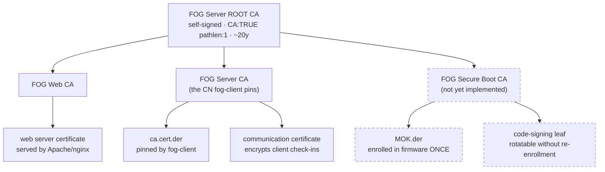

# FOG's certificate zones

FOG uses certificates for three unrelated jobs. This describes how they are
separated, how to replace any of them with your own, and what changes on the
endpoints when you do.

> **Status:** the split layout is implemented but **off by default**. A fresh
> install still gets the historic single-CA layout unless you pass
> `--split-pki`. See [Current status](#current-status) for why.

## The three zones

| Zone | What it protects | Lifetime | Cost of changing it |
|---|---|---|---|
| **Web TLS** | The browser/API connection to the FOG web UI | 90 days – 1 yr | None. Browsers just need the issuer trusted. |
| **Client Communication** | fog-client's encrypted check-in with the server | 3 – 5 yrs | Medium. Every registered client must re-pin. |
| **Secure Boot** | The signature on the FOS kernels | 10 – 20 yrs | High. Firmware re-enrollment on every machine. |

They have nothing in common except that FOG generates all three, and their
costs differ by orders of magnitude — which is exactly why they should not
share key material.

## Why they were separated

In the historic layout one self-signed CA did the first two jobs, and one
self-signed leaf did the third. That produced two problems that look
unrelated but have the same shape:

**`.srvprivate.key` was the web server's TLS key *and* the key that decrypts
every fog-client handshake.** `FOGBase::certDecrypt()` opens it on every
`authorize()` call. So replacing the web certificate — an ACME renewal,
`--recreate-keys`, dropping in a purchased cert — silently breaks client
authentication, with a perfectly valid certificate installed and nothing in
the logs connecting the two.

**The enrolled Secure Boot MOK was the signing certificate itself.** Because
the thing in the firmware was a leaf that can issue nothing, rotating or
revoking the signing key meant a physical MokManager trip to every machine,
and a storage node could not sign kernels at all without being handed the one
key the entire fleet trusts.

Both are the same mistake: one file serving as both a *trust anchor* and an
*operational key*, so the thing you must never change and the thing you want
to change routinely are the same object.

## The split layout



Dashed = designed, not yet built. See [Current status](#current-status).

On disk, under `/opt/fog/snapins/ssl/CA/` (everything is a dotfile — use
`ls -a`):

```
root/.fogRootCA.{key,pem}          the anchor. Never regenerated.
web/.fogWebCA.{key,pem}            signs the vhost's certificate
web/.fogWebCAchain.pem             root + web intermediate
client/.fogClientCA.{key,pem}      published as ca.cert.der; issues only the comm leaf
client/comm/.commLeaf.{key,pem}    what certDecrypt() actually opens
```

## Choosing a layout

```bash
./installfog.sh --split-pki     # three zones
./installfog.sh --legacy-pki    # single self-signed CA (current default)
```

Both are supported. Legacy is not deprecated — it is a smaller thing to
operate, and if you are not replacing certificates it costs you nothing.

An **existing** install is never switched automatically. A server that
already has certificate material stays on whatever layout it has, whatever a
fresh install would choose, because changing it would strand every client
that pinned the old CA.

## Bringing your own CA

Each zone is independently replaceable. Replace one, two, or none.

```bash
# Web zone only -- your PKI issues the web certificate, FOG keeps the rest
./installfog.sh --split-pki \
    --web-ca-cert /etc/pki/web-int.pem \
    --web-ca-key  /etc/pki/web-int.key \
    --web-ca-root /etc/pki/root.pem

# Client zone only -- e.g. a sub-CA minted from AD CS
./installfog.sh --split-pki \
    --client-ca-cert /etc/pki/fog-client-int.pem \
    --client-ca-key  /etc/pki/fog-client-int.key \
    --client-ca-root /etc/pki/root.pem
```

`--external-ca`/`--ca-cert`/`--ca-key`/`--ca-root` still work and target the
**Web** zone, which is what they have always effectively meant.

**The Client zone has a naming constraint.** fog-client is understood to
require the exact Common Name `FOG Server CA` on the certificate it pins, so
a CA you mint for that zone should carry it. FOG warns rather than refuses on
a mismatch — the requirement is not verified against the client source, and
an admin testing whether it actually matters should be able to. Override the
expected name with `--client-ca-cn` if you find it differs.

## Certificate paths

FOG's own consumers — the vhost, `sbsign`, `certDecrypt()` — only ever
reference fixed canonical paths. Those paths may be symlinks, so the real
files can live wherever you keep certificates:

```bash
# keep the real key in /etc/pki, point FOG's canonical path at it
sed -i "s|^sslprivkey=.*|sslprivkey='/etc/pki/fog/server.key'|" /opt/fog/.fogsettings
./installfog.sh -Y
```

Relocating a certificate then never means editing the vhost.

Two things that bite: SELinux labels follow the symlink **target**, so a
certificate outside the expected directories may need `restorecon` or
`semanage fcontext` on the real path. And a private key relocated into a
world-readable directory silently defeats the `0600 root:root` separation the
`fog-sign-kernel` sudo helper depends on.

## Let's Encrypt and ACME

**FOG does not run an ACME client and will not.** Use `certbot`, `acme.sh`,
or whatever your site already runs, and point its install hook at the paths
FOG's vhost reads. Full walkthrough in
[EXTERNAL_CA_AND_LETSENCRYPT.md](EXTERNAL_CA_AND_LETSENCRYPT.md).

Set `acmeLeaf="yes"` in `/opt/fog/.fogsettings` so the installer stops
regenerating the leaf. Without it, the next run rebuilds the certificate from
FOG's original CSR — a stale public key — against the private key your ACME
client installed, producing a mismatch that stops the web server.

> On a **legacy** install, do not let your ACME client replace
> `.srvprivate.key`: it is also the key that decrypts client handshakes.
> Issue against FOG's existing key instead. On a **split** install this does
> not apply, which is one of the concrete reasons to use it.

## HTTPS and netboot

iPXE can only validate a chain ending in a **public** root, through its
`ca.ipxe.org` cross-signing fallback. It cannot be told to trust anything.

| Web certificate issued by | Web UI / API / fog-client | iPXE netboot |
|---|---|---|
| Public CA (Let's Encrypt) | HTTPS, trusted natively | **HTTPS works**, FQDN only |
| FOG's own PKI | HTTPS once the root is trusted | HTTP |
| Your internal PKI | HTTPS once your root is trusted | HTTP |

On a split install with `httpproto=https`, netboot automatically stays on
HTTP while everything else is HTTPS. That avoids the historic trade where
enabling HTTPS meant rebuilding iPXE with the CA baked in — which works, and
forfeits the signed Secure Boot shim, because a locally rebuilt binary is not
the signed one. Override with `--netboot-proto http|https`.

**Public Let's Encrypt for netboot** works only on an FQDN in a domain you
control — it need not be publicly reachable, DNS-01 is enough — and only on
that exact FQDN, not a short hostname and not an IP. Set `FOG_WEB_HOST` to
that FQDN or the generated boot URLs will not match the certificate.

## Current status

| Piece | State |
|---|---|
| Root CA, Web and Client intermediates, comm certificate | Implemented, `--split-pki` |
| `certDecrypt()` reading the comm key | Implemented |
| Per-zone bring-your-own-CA flags | Implemented |
| `netbootproto` separation | Implemented |
| Split as the **default** | **Not yet** — see below |
| Secure Boot intermediate | **Not yet** — see below |

Two assumptions are unverified, and both are about software outside this
repository:

1. **How fog-client obtains the server's encryption certificate.** The
   layout assumes it fetches `srvpublic.crt`, which is where FOG publishes
   the comm certificate. If it derives a key from `ca.cert.der` instead, the
   Client CA doubles as the comm keypair and the published files change.
2. **Whether shim accepts a CA in MokList** with the signing chain attached
   via `sbsign --addcert`. The whole "rotate signing leaves without touching
   firmware" premise depends on it, and it needs testing on real UEFI
   hardware.

Defaulting fresh installs to split before those are answered would bet every
new install on them, so the default stays legacy until they are. Neither
affects an existing server, and the zones are independent — a negative answer
on (2) costs the Secure Boot zone only.
