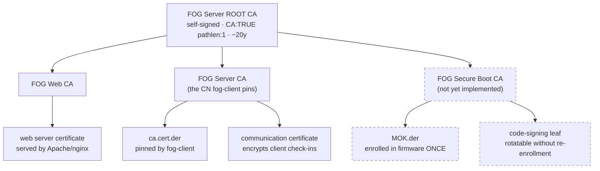

# FOG's certificate zones

FOG uses certificates for three unrelated jobs. This describes how they are
separated, how to replace any of them with your own, and what changes on the
endpoints when you do.

> **Status:** the split layout is the **default for fresh installs**. An
> existing server keeps the layout it already has and is never switched
> automatically. `--legacy-pki` opts a fresh install back to the single
> self-signed CA.

## The three zones

| Zone | What it protects | Lifetime | Cost of changing it |
|---|---|---|---|
| **Web TLS** | The browser/API connection to the FOG web UI | 90 days – 1 yr | None. Browsers just need the issuer trusted. |
| **Client Communication** | fog-client's encrypted check-in with the server | 3 – 5 yrs | Medium. Every registered client must re-pin. |
| **Secure Boot** | The signature on the FOS kernels | 10 – 20 yrs | High. Firmware re-enrollment on every machine. |

They have nothing in common except that FOG generates all three, and their
costs differ by orders of magnitude — which is exactly why they should not
share key material.

## Why they were separated

In the historic layout one self-signed CA did the first two jobs, and one
self-signed leaf did the third. That produced two problems that look
unrelated but have the same shape:

**`.srvprivate.key` was the web server's TLS key *and* the key that decrypts
every fog-client handshake.** `FOGBase::certDecrypt()` opens that exact path
on every `authorize()` call.

The distinction that matters, because it decides which workarounds are safe:
the coupling is to **the file**, not to the concept of "the web certificate".

| What you do | Client auth |
|---|---|
| Point `SSLCertificateFile`/`SSLCertificateKeyFile` at your own cert elsewhere | **Fine.** FOG's key is untouched; `certDecrypt()` still reads it. |
| Overwrite `.srvprivate.key` in place — `acme.sh --install-cert --key-file`, `certbot` writing over it, `--recreate-keys` | **Breaks.** Valid certificate installed, clients stop authenticating, nothing in the logs connects the two. |

So on a legacy install the safe way to use your own certificate is to leave
FOG's files alone and point the vhost somewhere else — which is what the
managed vhost block exists to let you keep across upgrades (see
[SUPPORTED_CUSTOMIZATIONS.md](SUPPORTED_CUSTOMIZATIONS.md)).

Confirmed on a real server: `openssl` moduli show `.srvprivate.key` pairs
with `srvpublic.crt` (the web leaf), not with `ca.cert.pem` (the CA).

**The enrolled Secure Boot MOK was the signing certificate itself.** Because
the thing in the firmware was a leaf that can issue nothing, rotating or
revoking the signing key meant a physical MokManager trip to every machine,
and a storage node could not sign kernels at all without being handed the one
key the entire fleet trusts.

Both are the same mistake: one file serving as both a *trust anchor* and an
*operational key*, so the thing you must never change and the thing you want
to change routinely are the same object.

## The split layout



Dashed = designed, not yet built. See [Current status](#current-status).

On disk, under `/opt/fog/snapins/ssl/CA/` (everything is a dotfile — use
`ls -a`):

```
root/.fogRootCA.{key,pem}          the anchor. Never regenerated.
web/.fogWebCA.{key,pem}            signs the vhost's certificate
web/.fogWebCAchain.pem             root + web intermediate
client/.fogClientCA.{key,pem}      published as ca.cert.der; issues only the comm leaf
client/comm/.commLeaf.{key,pem}    what certDecrypt() actually opens
```

## Choosing a layout

```bash
./installfog.sh                 # three zones -- the default on a fresh install
./installfog.sh --legacy-pki    # single self-signed CA instead
```

Both are supported. Legacy is not deprecated — it is a smaller thing to
operate, and if you are not replacing certificates it costs you nothing.

An **existing** install is never switched automatically. A server that
already has certificate material stays on whatever layout it has, whatever a
fresh install would choose, because changing it would strand every client
that pinned the old CA.

## Taking the Root CA offline

The root's private key is generated on the server and left there, `0600
root:root`. That is a deliberate starting point, not the recommended end
state: requiring a vault on day one would make a first install harder for
everyone, including people who will never run a real offline root.

**Moving it off is a manual step today** — there is no helper script yet.

```bash
# copy it somewhere durable and offline, then remove it from the server
install -m 0600 /opt/fog/snapins/ssl/CA/root/.fogRootCA.key /mnt/vault/
shred -u /opt/fog/snapins/ssl/CA/root/.fogRootCA.key
```

Leave `.fogRootCA.pem` in place. The **certificate** is what everything
chains to and what the installer uses to recognise that a root already
exists; only the key needs protecting.

Day to day nothing needs it. The intermediates are already issued, and each
one short-circuits on every later run without the root key being touched. It
is required only to issue a **new** intermediate — which in practice means a
first install, or adding a zone you previously skipped. The installer detects
its absence and tells you exactly what to restore rather than failing
somewhere inside openssl:

```
 * Cannot issue 'FOG Web CA': the Root CA private key is not on this server
 * That is the correct state for an offline root, but issuing a new
   intermediate needs it. Restore it to:
     /opt/fog/snapins/ssl/CA/root/.fogRootCA.key
   re-run the installer, then move it back to your vault.
```

> Removing the key does **not** cause the root to be regenerated. That is
> worth stating because the obvious implementation gets it wrong — testing
> for "key and cert both present" would mint a fresh root the first time
> anyone followed this advice, orphaning every intermediate beneath it.

## Bringing your own CA

Each zone is independently replaceable. Replace one, two, or none.

```bash
# Web zone only -- your PKI issues the web certificate, FOG keeps the rest
./installfog.sh --split-pki \
    --web-ca-cert /etc/pki/web-int.pem \
    --web-ca-key  /etc/pki/web-int.key \
    --web-ca-root /etc/pki/root.pem

# Client zone only -- e.g. a sub-CA minted from AD CS
./installfog.sh --split-pki \
    --client-ca-cert /etc/pki/fog-client-int.pem \
    --client-ca-key  /etc/pki/fog-client-int.key \
    --client-ca-root /etc/pki/root.pem
```

`--external-ca`/`--ca-cert`/`--ca-key`/`--ca-root` still work and target the
**Web** zone, which is what they have always effectively meant.

**The Client zone has a naming constraint.** fog-client is understood to
require the exact Common Name `FOG Server CA` on the certificate it pins, so
a CA you mint for that zone should carry it. FOG warns rather than refuses on
a mismatch — the requirement is not verified against the client source, and
an admin testing whether it actually matters should be able to. Override the
expected name with `--client-ca-cn` if you find it differs.

## Certificate paths

FOG's own consumers — the vhost, `sbsign`, `certDecrypt()` — only ever
reference fixed canonical paths. Those paths may be symlinks, so the real
files can live wherever you keep certificates:

```bash
# keep the real key in /etc/pki, point FOG's canonical path at it
sed -i "s|^sslprivkey=.*|sslprivkey='/etc/pki/fog/server.key'|" /opt/fog/.fogsettings
./installfog.sh -Y
```

Relocating a certificate then never means editing the vhost.

Two things that bite: SELinux labels follow the symlink **target**, so a
certificate outside the expected directories may need `restorecon` or
`semanage fcontext` on the real path. And a private key relocated into a
world-readable directory silently defeats the `0600 root:root` separation the
`fog-sign-kernel` sudo helper depends on.

## Let's Encrypt and ACME

**FOG does not run an ACME client and will not.** Use `certbot`, `acme.sh`,
or whatever your site already runs, and point its install hook at the paths
FOG's vhost reads. Full walkthrough in
[EXTERNAL_CA_AND_LETSENCRYPT.md](EXTERNAL_CA_AND_LETSENCRYPT.md).

Set `acmeLeaf="yes"` in `/opt/fog/.fogsettings` so the installer stops
regenerating the leaf. Without it, the next run rebuilds the certificate from
FOG's original CSR — a stale public key — against the private key your ACME
client installed, producing a mismatch that stops the web server.

> On a **legacy** install, do not let your ACME client replace
> `.srvprivate.key`: it is also the key that decrypts client handshakes.
> Issue against FOG's existing key instead. On a **split** install this does
> not apply, which is one of the concrete reasons to use it.

## HTTPS and netboot

iPXE can only validate a chain ending in a **public** root, through its
`ca.ipxe.org` cross-signing fallback. It cannot be told to trust anything.

| Web certificate issued by | Web UI / API / fog-client | iPXE netboot |
|---|---|---|
| Public CA (Let's Encrypt) | HTTPS, trusted natively | **HTTPS works**, FQDN only |
| FOG's own PKI | HTTPS once the root is trusted | HTTP |
| Your internal PKI | HTTPS once your root is trusted | HTTP |

On a split install with `httpproto=https`, netboot automatically stays on
HTTP while everything else is HTTPS. That avoids the historic trade where
enabling HTTPS meant rebuilding iPXE with the CA baked in — which works, and
forfeits the signed Secure Boot shim, because a locally rebuilt binary is not
the signed one. Override with `--netboot-proto http|https`.

**Public Let's Encrypt for netboot** works only on an FQDN in a domain you
control — it need not be publicly reachable, DNS-01 is enough — and only on
that exact FQDN, not a short hostname and not an IP. Set `FOG_WEB_HOST` to
that FQDN or the generated boot URLs will not match the certificate.

## Current status

| Piece | State |
|---|---|
| Root CA, Web and Client intermediates, comm certificate | Implemented, `--split-pki` |
| `certDecrypt()` reading the comm key | Implemented |
| Per-zone bring-your-own-CA flags | Implemented |
| `netbootproto` separation | Implemented |
| Split as the **default** for fresh installs | Implemented |
| Secure Boot intermediate | Implemented — verified on real UEFI hardware |

### Secure Boot

The Secure Boot zone follows the same shape as the other two: the Root issues
a **FOG Secure Boot CA**, that intermediate is what gets enrolled in firmware
(`MOK.der`), and it issues a short-lived **code-signing leaf** that actually
signs the FOS kernels. `sbsign --addcert` embeds the intermediate in the
signature so shim can chain the leaf back to what was enrolled.

The point is rotation. Under the flat model the enrolled certificate *is* the
signer, so replacing a signing key means a physical MokManager trip to every
machine, and a storage node cannot sign at all without holding the fleet's one
trusted key. Enrolling the issuer instead means leaves can be rotated, revoked
or issued per node while the fleet keeps booting.

Verified on a real server: the chain verifies, the leaf carries the
`codeSigning` EKU, `MOK.der` publishes the **intermediate**, and a signed
kernel contains **both** certificates:

```
$ sbverify --list bzImage
 - subject: /CN=FOG Project Secure Boot Signing
   issuer:  /CN=FOG Secure Boot CA
 - subject: /CN=FOG Secure Boot CA
   issuer:  /CN=FOG Server ROOT CA
```

**Confirmed on real UEFI hardware, both enrolment routes:** machines boot
FOG's leaf-signed kernels while trusting only the **intermediate** — whether
that intermediate is enrolled as `MOK.der` through MokManager, or written into
`db` through the Setup Mode PK/KEK/db path.

That is the whole design validated in the place it matters. Firmware and shim
both accept a certificate chain terminating at the enrolled CA rather than
demanding the exact signer, so a signing leaf can be rotated, revoked, or
issued per storage node and the fleet keeps booting with no firmware trip.

**`efitools` is unreliable on EL9 and should not be assumed present.** It is a
declared dependency and installs normally on Debian/Ubuntu. On EL9 the picture
is inconsistent:

- On the **CentOS Stream 9** test box it is unavailable with EPEL *and* CRB
  enabled, and nothing else provides
  `sign-efi-sig-list`/`cert-to-efi-sig-list`.
- The upstream RPM tracker
  ([rpms.remirepo.net](https://rpms.remirepo.net/rpmphp/zoom.php?rpm=efitools))
  lists **Fedora branches only** — no EL9/EPEL rows at all.
- It is nonetheless present and working on at least one **Rocky 9** FOG
  server, source not established — plausibly an EPEL build that has since been
  retired, or installed from elsewhere.

So on EL9 the installer will often report it missing and skip building the
signed PK/KEK/db blobs. If you have it working on an EL9 box, check where it
came from (`rpm -q --queryformat '%{VENDOR} %{URL}\n' efitools`) before
assuming a fresh install will get it.

Only the three userspace tools are needed, and they build in about a minute:

```bash
dnf -y install gcc make openssl-devel git gnu-efi-devel
git clone --depth 1 \
    https://git.kernel.org/pub/scm/linux/kernel/git/jejb/efitools.git
cd efitools
make cert-to-efi-sig-list sign-efi-sig-list efi-updatevar
install -m 0755 cert-to-efi-sig-list sign-efi-sig-list efi-updatevar /usr/bin/
```

`gnu-efi-devel` is required even for the userspace tools — they include
`efi.h`. The EFI binaries (`KeyTool.efi` et al.) are not needed and are not
built here.

**Verified with those tools present:** the installer builds `PK.auth`,
`KEK.auth` and `db.auth`, and `db.auth` embeds `CN=FOG Secure Boot CA` — the
**intermediate** — beside Microsoft's CAs, with the signing leaf's CN absent.
That is what makes leaf rotation safe for Setup-Mode-enrolled clients too, not
just MokManager-enrolled ones.

MOK enrolment via MokManager is unaffected either way; only the unattended
Setup Mode path needs those tools. Where the package is genuinely absent it
has to be built from source.

Practical consequence for this work: the `db` change described above is
**untested**, because the one machine available for testing could not install
the tooling that exercises it. Verify on Rocky 9 or Debian/Ubuntu.

An existing server that has ever generated a MOK keeps using it, even under
`--split-pki`, since a machine may already have enrolled it.

Verified on a real server by uninstalling, purging the CA and installing
fresh: the root and both intermediates issue correctly, all four chains
verify, `ca.cert.der` publishes the Client CA while the vhost serves the web
leaf, and the key `certDecrypt()` opens is provably a different keypair from
the web server's — which is the entire point.

**fog-client is confirmed working against a split server.** It fetches the
comm certificate from the path it always has, so the split needed no client
change.

### Known follow-up: the client trusts the intermediate, not the root

During installation fog-client adds **`FOG Server CA` — the Client
Communication intermediate — to the Windows Root store**, rather than the
actual `FOG Server ROOT CA`. It works, and nothing is broken. But it is the
wrong anchor, and it costs two things:

- **Rotation.** Trusting the intermediate as an anchor means replacing that
  intermediate requires re-pushing trust to every client — the exact cost the
  Secure Boot zone just eliminated by enrolling the issuer. Trusting the root
  would let the Client CA be rotated freely.
- **HTTPS by default.** The client trusts only the Client zone's intermediate,
  which does not sign the web certificate — the **Web CA** does. So the web
  certificate is not trusted and HTTPS cannot be enabled by default. If the
  client trusted the **root**, every zone beneath it would validate, and an
  all-FOG-PKI install could turn HTTPS on out of the box.

That change lives in the `zazzles`/fog-client repository, not here. Nothing in
this repo needs to change to accommodate it: the root certificate is already
published in the chain, and `ca.cert.der` continues to carry the intermediate
for the existing pinning behaviour.

One thing remains unverified here: **nginx**. Every vhost change was exercised
on Apache only, and both the managed-block splice and the `netbootproto`
redirect exclusion have nginx branches that have never executed.

An existing server is never switched automatically, so nothing above can
affect a server that is already running.
