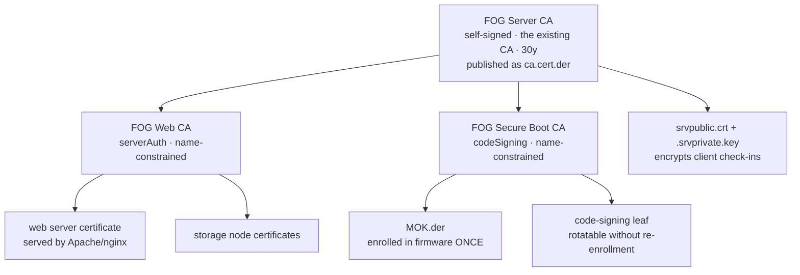

# FOG's certificate zones

FOG uses certificates for three unrelated jobs. This describes how they are
separated, how to replace any of them with your own, and what changes on the
endpoints when you do.

> **Status:** applied to every server, including existing ones, on an ordinary
> update. There is no opt-in flag and no second layout to choose between.

## The three zones

| Zone | What it protects | Lifetime | Cost of changing it |
|---|---|---|---|
| **Web TLS** | The browser/API connection to the FOG web UI | 90 days – 1 yr | None. Browsers just need the issuer trusted. |
| **Client Communication** | fog-client's encrypted check-in with the server | 3 – 5 yrs | Medium. Every registered client must re-pin. |
| **Secure Boot** | The signature on the FOS kernels | 10 – 20 yrs | High. Firmware re-enrollment on every machine. |

They have nothing in common except that FOG generates all three, and their
costs differ by orders of magnitude — which is exactly why they should not
share key material.

## Why they were separated

In the historic layout one self-signed CA did the first two jobs, and one
self-signed leaf did the third. That produced two problems that look
unrelated but have the same shape:

**`.srvprivate.key` was the web server's TLS key *and* the key that decrypts
every fog-client handshake.** `FOGBase::certDecrypt()` opens that exact path
on every `authorize()` call. So an ACME renewal with `--key-file`, a purchased
certificate dropped in place, or `--recreate-keys` installed a perfectly valid
certificate and silently broke client authentication, with nothing in the logs
connecting the two.

Confirmed on a real server: `openssl` moduli showed `.srvprivate.key` paired
with `srvpublic.crt` (the web leaf), not with `ca.cert.pem` (the CA).

**The enrolled Secure Boot MOK was the signing certificate itself.** Because
the thing in the firmware was a leaf that can issue nothing, rotating or
revoking the signing key meant a physical MokManager trip to every machine,
and a storage node could not sign kernels at all without being handed the one
key the entire fleet trusts.

Both are the same mistake: one file serving as both a *trust anchor* and an
*operational key*, so the thing you must never change and the thing you want
to change routinely are the same object.

## The layout



The anchor is the CA your server already has. Nothing above it is created, so
`ca.cert.der` does not change, no fog-client re-pins, and an existing server
gets the separation on an ordinary update.

That also has a useful consequence: because the certificate fog-client pins
**is** the root, the Web CA sits beneath something every client already
trusts. Trusting `ca.cert.der` now validates the web certificate too.

Under `$fogprogramdir/pki/` (default `/opt/fog/pki/`), one subfolder per zone,
each split into `ca/` (the zone's own CA material) and `leaf/` (what that CA
issues day to day) — everything is a dotfile (`ls -a`):

```
root/ca/.fogCA.{key,pem}          the anchor. Key never regenerated, 0400 root:root.
                                   .fogCA.pem is a symlink to wherever the
                                   certificate already lived before this split.
conf/req.cnf                      the CSR subject and SANs, and the v3 extensions
conf/ca.cnf                        written into a signed certificate. SHARED --
                                   both issuing zones read them, so the two can
                                   never disagree about the names this server
                                   answers to. Also read by renewal-helper.
client/leaf/.srvprivate.key       the client communication keypair, which every
client/leaf/.srvpublic.crt         registered fog-client pins. The REAL files.
                                   0640 root:$apacheuser, in a 0710 directory --
                                   the web tier has to read the key on every
                                   handshake, so this is the one leaf/ that is
                                   not 0700 root:root.
                                   $PKI_client_cert_dir/.srvprivate.key and
                                   .srvpublic.crt are symlinks to these.
client/leaf/fog.csr               the comm leaf's own CSR, kept with the leaf it
                                   requested.
web/ca/.fogWebCA.{key,pem}        signs the vhost's certificate and node certificates
web/ca/.fogWebCAchain.pem         CA + web intermediate
web/leaf/.webLeaf.{key,pem}       what the web server actually serves
web/ca/.trustAnchor.pem           what this server anchors the web zone on: the
                                  FOG root, plus an imported root where there is
                                  one, deduped by fingerprint
web/dhparam.pem                   Diffie-Hellman parameters the nginx vhost
                                  names directly
secureboot/ca/.fogSBCA.{key,pem,der}  signs the code-signing leaf; .der is
                                  the same certificate MOK.der publishes, kept
                                  here so it can be verified without reaching
                                  into the web root
secureboot/leaf/sign.{key,pem}    what sbsign actually signs with
secureboot/MOK.{key,pem}          the flat, no-intermediate fallback signing
                                  key -- present only on a root that can't
                                  anchor an intermediate, or before one has
                                  been minted
secureboot/PK.{key,pem}           the platform key, if automatic PK/KEK/db
secureboot/KEK.{key,pem}          enrollment is configured. Never regenerated.
secureboot/admin-MOK.{key,pem}    an admin-supplied --secure-boot-key/-cert
                                  pair, copied in so it survives independent
                                  of wherever the admin originally put it
secureboot/mscerts/               Microsoft's published CA certs, staged here
                                  for the PK/KEK/db builder; fully reproducible
                                  from packages/secureboot/mscerts
```

Nothing PKI-related is left directly under `$fogprogramdir/secureboot` any more
-- an install that already had one migrates every one of the files above into
`pki/secureboot/` in place, and the old directory is left empty once that's
done (safe to remove by hand). `$fogprogramdir/secureboot-staging` is a
separate, web-user-writable directory for in-flight kernel-signing requests --
unrelated key material, and deliberately not part of this tree.

`.srvprivate.key`/`.srvpublic.crt` used to live directly at
`$PKI_client_cert_dir` — i.e. `$snapindir/ssl`, the same directory an admin edits
to change snapin SSL and the directory the snapin replicator walks. So "change
the snapin certificates" and "replace the one keypair every registered client
pins" were the same operation on the same directory, and the second is invisible
until hosts stop checking in.

They now live in their own zone at `pki/client/leaf/`, with a **symlink per file**
left at the historic names. Per file rather than a directory symlink on purpose:
symlinking `$snapindir/ssl` itself would put snapin uploads straight back beside
the keypair. The names have to keep resolving because `FOGBase::_decryptCheck()`
builds `<sslpath>/.srvprivate.key` with the filename hardcoded, taking the
directory from the storage-node database record rather than from `.fogsettings`.

The rest of that directory moved too, and not all to the same place — where a
file went says what it is:

| File | New home | Why there |
|---|---|---|
| `fog.csr` | `pki/client/leaf/` | the comm leaf's own request, so it belongs with the leaf |
| `req.cnf`, `ca.cnf` | `pki/conf/` | **shared** — the client leaf *and* the web leaf read both, so neither zone owns them, and putting them under one would make that zone's directory a dependency of the other's issuance |
| `dhparam.pem` | `pki/web/` | web-server TLS parameters, named directly by the nginx vhost |

None of these gets a compatibility symlink, and that is the difference from the
keypair rather than an inconsistency: the keypair's canonical names are baked
into `FOGBase`, so they had to keep resolving. These are named only by the
installer, by `packages/pki/renewal-helper` (updated with them), and by the vhost
the installer writes — a symlink would be a second name for a file with one
reader.

`ca.cnf`'s **bytes** are unchanged by the move, which matters more than it looks:
`_createWebLeaf` hashes that file into `.webLeaf.sans` to decide whether the web
leaf's name set changed. Moving it without touching its contents leaves the stamp
valid, so no server re-issues its web certificate over this. Verified on a live
upgrade: identical stamp, identical web-leaf and comm-leaf fingerprints.

Only the legacy `CA/` tree stays behind. The root certificate genuinely lives
there — `pki/root/ca/.fogCA.pem` is a symlink to it — and the web UI reads it to
report offline-key state.

`SnapinReplicator` no longer replicates `ssl/fog.csr` to storage nodes. It is the
*master's* client-communication CSR, a request fulfilled long ago, and a node has
no use for it: a node generates its own keypair and its own CSR and is issued a
certificate by the master's Web CA (below). `ssl/CA` still replicates — that is
the CA certificate, public trust material a node legitimately holds.

## Storage node certificates

A node never sends a private key anywhere. `_requestNodeCert()` generates a
keypair and a CSR **on the node**, POSTs the CSR to the master's
`service/nodecert.php`, and installs what comes back as its web vhost
certificate. The master signs through `fog-sign-node-cert`, a root-only helper
the web user may invoke but cannot hand paths to — every path comes from a
root-owned config, which is what stops a compromised web tier naming its own CA
key.

**This works when the Web CA is an imported one, and did not before.** The helper
used to append `PKI_ROOT_CERT` to the chain it returned and verify the freshly
signed leaf against `PKI_ROOT_CERT` — the FOG root, which on a bring-your-own-CA
server never signed that intermediate. `openssl verify` therefore could not build
a chain and *every* node request was refused, with a message blaming name
constraints for something that was never a name problem.

Two config values fix it, and both are per-zone because the zones are not
anchored by the same thing:

| Value | Is | Why not `PKI_ROOT_CERT` |
|---|---|---|
| `PKI_WEB_ANCHOR` | `pki/web/ca/.trustAnchor.pem` | carries the FOG root **and** an imported root where there is one, so one path verifies on either kind of install |
| `PKI_WEB_CHAIN` | `PKI_web_trust_chain` | already *is* issuer-plus-its-root, so it is the right thing for a node to serve beneath its leaf; building it from the FOG root appended an unrelated certificate |

The Secure Boot zone keeps `PKI_ROOT_CERT` as its anchor, and that is not an
oversight: there is no "bring your own Secure Boot root", because firmware trusts
the enrolled certificate directly and nothing above it is ever consulted.

`pki/root/leaf/` held discoverability symlinks to the keypair while it lived in
the snapin directory. It is retired — a second set of links pointing at the first
had nothing reading either — and removed on upgrade if it holds nothing but those
links.

An install that already ran an earlier layout (flat `CA/.fogCA.*` directly
under `$PKI_client_cert_dir`, or the intermediate one-level-down `CA/web/.fogWebCA.*`
split) migrates its key/cert material into the new tree in place on the next
run — no re-issuing, and the old paths keep resolving via symlink where
anything might still reference them directly.

## What an upgrade does and does not change

| | |
|---|---|
| `pki/root/ca/.fogCA.pem` | **unchanged**, byte for byte |
| `ca.cert.der` | **unchanged** — no client re-pins |
| `.srvprivate.key` | **same bytes** — moved into `pki/client/leaf/`, with a symlink left at the old path. Client authentication is unaffected |
| `srvpublic.crt` | the same certificate, adopted rather than re-issued |
| the web certificate | **new**, issued by the Web CA, on its own keypair |
| the Secure Boot MOK | **new** — see below, this one needs action |

The only endpoint-visible change is Secure Boot.

## Private key protection

The CA private key used to be readable by the web user. `$PKI_client_cert_dir` lives under
`$snapindir`, and `configureSnapins()` chowned that whole tree to
`${SVC_user}:$apacheuser` at mode 775 — so a remote code execution in the PHP
application could read the key the entire installation trusts. It also ran
*after* certificate creation, so setting stricter permissions during
`createSSLCA` had no effect at all: they were overwritten later in the same
install.

`$PKI_client_cert_dir` is now excluded from that recursion and the permissions are applied
afterwards, from `_hardenPkiPermissions`:

| File | Mode | Why |
|---|---|---|
| `pki/root/ca/.fogCA.key` | `0400 root:root` | nothing on a running server needs it |
| `pki/secureboot/ca/.fogSBCA.key` | `0400 root:root` | same |
| `pki/web/ca/.fogWebCA.key` | `0600 root:root` | used only by root, through the sudo helper |
| `.srvprivate.key` | `0640 root:<apache>` | `certDecrypt()` must read this one |

The **Certificates** page under FOG Configuration re-runs that check from
inside the web application, which is the only place it can be answered
honestly: if PHP can open one of those keys, PHP is what would leak it.

This is *pseudo-offline*. It protects the keys from a compromise of the web
application, not from a compromise of the machine.

## Taking a key offline

```bash
/opt/fog/bin/fog-offline-ca-key /mnt/vault                  # the CA key
/opt/fog/bin/fog-offline-ca-key /mnt/vault --zone secureboot
```

The helper copies the key, verifies the copy still matches the certificate
that stays behind, and only then shreds the original.

**Leave the certificate in place.** Everything chains to it, and the installer
uses its presence to recognize that a CA already exists. Removing the
certificate is what makes the next run mint a fresh one, orphaning every
intermediate beneath it — which is precisely the mistake the obvious manual
version ("move the CA out of the way") makes.

Day to day nothing needs the key. It is required only to issue a **new**
intermediate, or a certificate for a **new** storage node. The installer
detects its absence and says what to restore rather than failing somewhere
inside openssl:

```
 * Cannot issue 'FOG Web CA': the Root CA private key is not on this server
 * That is the correct state for an offline root, but issuing a new
   intermediate needs it. Restore it to:
     /opt/fog/pki/root/ca/.fogCA.key
   re-run the installer, then move it back to your vault.
```

> Removing the key does **not** cause the CA to be regenerated. That is worth
> stating because the obvious implementation gets it wrong — testing for "key
> and cert both present" would mint a fresh CA the first time anyone followed
> this advice.

Before offlining the Secure Boot key, issue signing certificates to every
storage node that needs one. Restoring it later for a new node is supported,
but it is a trip to the vault.

## Leaf renewal

The web leaf and the Secure Boot signing leaf default to 5 years — short
enough that a compromised leaf key ages out on its own, long enough that
nothing renews them automatically. To rotate either one sooner:

```bash
/opt/fog/pki/renewal-helper --zone web
/opt/fog/pki/renewal-helper --zone secureboot
```

>[!warning]
>This helper was **missed entirely by the GH-1120 key rename** and was broken on
>every 1.6 server until it was fixed alongside the moves above. It read eleven
>retired key names — `sslpath`, `sslprivkey`, `sslpubcert`, `sslcakey`,
>`sslcapem`, `sslcachain`, `rootCAPem`, `hostname`, `osid` and `acmeLeaf` — all
>of which `deprecatedKeys` *strips* from `.fogsettings`. Each read therefore
>produced an empty string and fell through to a default: correct only on a server
>that had customised nothing. `$fogprogramdir` is the one old spelling still
>right, because `/etc/fog/fog.conf` is deliberately exempt from the rename.
>
>It also refused on `acmeLeaf=yes`, a key that no longer exists. It now asks the
>filesystem the same question `_externallyManagedLeaf()` does — does the
>canonical path resolve outside the web zone — and it verifies the reissued leaf
>against `.trustAnchor.pem` rather than the FOG root, so it works on an
>external-CA install too.

The web leaf re-issues from the online Web CA (or the root directly, on a
server whose root can't anchor an intermediate) and reloads Apache so it
picks up the new certificate. The Secure Boot leaf re-issues from the Secure
Boot CA and needs no reload — `fog-sign-kernel` reads it fresh from disk on
every signing operation, and nothing has to be re-enrolled in firmware
(that's what the intermediate, not the leaf, being enrolled buys you).

Either invocation refuses and tells you the exact path to restore if the
signing CA's private key isn't on this server (`fog-offline-ca-key` moved it
out, or the Web CA key is simply missing). The web leaf invocation also
refuses if the leaf is managed outside FOG — renew that one through your
ACME client instead.

Nothing here runs on a timer. Wire it into your own cron if you want
unattended renewal; `installfog.sh` does not install one for you.

## Name constraints

Both intermediates carry an `extendedKeyUsage`, so neither can issue outside
its zone. Only the **Web CA** carries `nameConstraints`:

```
Web CA:          extendedKeyUsage = serverAuth
                 permitted DNS: this server's hostname and domain
                 permitted IP:  all RFC1918 ranges, plus this server's own
Secure Boot CA:  extendedKeyUsage = codeSigning
                 no nameConstraints -- see below
```

Extend or narrow with:

```bash
./installfog.sh --internal-domain branch.example.local   # repeatable
./installfog.sh --internal-subnet 10.20.30.0/24          # repeatable; REPLACES
                                                         # the RFC1918 default
```

Three things about this are easy to get wrong and cost a chain that verifies
nowhere:

- OpenSSL wants an IP subtree as `address/netmask`, never `address/prefixlen`.
  `10.0.0.0/8` does not build.
- RFC 5280 constrains only the name *types* present in `permittedSubtrees`, so
  DNS and IP are always emitted together. A certificate with an IP SAN under a
  DNS-only constraint is a violation.
- IPv4 and IPv6 subtrees never match each other, so a dual-stack server needs
  both. FOG emits the IPv6 entries only when the server actually has IPv6.

**Constraints are fixed when the CA is issued, and a CA is never re-issued.**
Renaming the server, or adding an `--extra-server-name` outside the permitted
domains, produces a valid certificate that nothing accepts. The installer
verifies the leaf against its issuer after signing and says so, naming the
`rm -rf` that lets the CA be re-created with the new constraints.

**The Secure Boot CA carries no `nameConstraints` at all**, and there is no flag
to add them (GH-1120 removed `--no-sb-name-constraints` along with the
`sbNameConstraints` key).

They constrained nothing that mattered for code signing — a code-signing leaf
carries no names anyone resolves — while sitting in the one certificate UEFI and
shim actually parse, where an extension the firmware mishandles costs a physical
trip to every machine. An opt-out flag was the wrong shape for that risk: it put
the safe answer behind something nobody passes until a fleet has already failed
to boot.

The Web CA keeps its constraints because ADR 0016 made them *enforceable* there —
iPXE is a verifier FOG can patch, and firmware is not.

A related trap this used to depend on, recorded because it explains the SAN on
the signing leaf: OpenSSL applies DNS constraints to the subject **CN** when a
certificate carries no DNS SAN. A CN of `evil.example.com` under a `corp.local`
constraint is rejected, and the Secure Boot signing CN passed only because
"FOG Project Secure Boot Signing" is not hostname-shaped and so is never read as
a DNS name. Depending on that would have meant a rename of that CN stopping the
fleet booting, so the signing leaf carries a permitted DNS SAN. That remains
true and harmless now that the zone is unconstrained.

## Bringing your own CA

Each zone is independently replaceable.

```bash
# Web zone -- your PKI issues the web certificate, FOG keeps the rest
./installfog.sh --web-ca-cert /etc/pki/web-int.pem \
                --web-ca-key  /etc/pki/web-int.key \
                --web-ca-root /etc/pki/root.pem

# Secure Boot zone -- your own intermediate is what firmware enrolls
./installfog.sh --secureboot-ca-cert /etc/pki/sb-int.pem \
                --secure-boot-key    /etc/pki/sb-leaf.key \
                --secure-boot-cert   /etc/pki/sb-leaf.pem
```

`--external-ca`/`--ca-cert`/`--ca-key`/`--ca-root` still work and target the
**Web** zone, which is what they have always effectively meant.

To point *several independent FOG servers* at one trust anchor — separate
installs, not storage nodes — see
[MULTI_SERVER_CA.md](MULTI_SERVER_CA.md), which covers this flag set applied
across a fleet and the alternatives to it.

**The Client Communication zone is not replaceable this way, deliberately.**
It is anchored at the certificate every fog-client has pinned, so replacing it
means re-deploying trust to every registered machine. That is possible — push
the new `ca.cert.der` by GPO or by reinstalling fog-client — but there is no
built-in path for it, because there is no way to do it without touching every
endpoint.

**If your CA carries `pathlen:0`** — an ordinary thing for an enterprise to
issue — it cannot anchor an intermediate. The installer detects this, says so,
signs the web certificate directly from it as before, and leaves Secure Boot on
its self-signed key. Nothing is silently broken.

## Storage nodes

A storage node used to generate its own independent self-signed
`FOG Server CA`, so a fleet of five nodes had six unrelated CAs. Nodes now ask
the master for a certificate from the Web CA.

The node authenticates with the fogstorage database password it already holds
— the same secret it uses to reach the master's database — so nothing new has
to be distributed. The master issues for the names in **its own record** of
that node; the node's request supplies a public key and nothing else, so a node
cannot obtain a certificate covering the master or another node.

Two consequences worth knowing:

- **The node must be registered first.** The request runs after
  `registerStorageNode` for exactly this reason. A node the master does not
  know is refused, by design.
- **Any failure falls back to a self-signed certificate**, exactly as before,
  with an explanation. A node install must not break against a master that has
  not been updated yet.

Issuance is logged to the web server error log on the master.

## Certificate paths

FOG's own consumers — the vhost, `sbsign`, `certDecrypt()` — only ever
reference fixed canonical paths. Those paths may be symlinks, so the real
files can live wherever you keep certificates:

```bash
sed -i "s|^PKI_web_vhost_key=.*|PKI_web_vhost_key='/etc/pki/fog/server.key'|" /opt/fog/.fogsettings
./installfog.sh -Y
```

Relocating a certificate then never means editing the vhost.

Two things that bite: SELinux labels follow the symlink **target**, so a
certificate outside the expected directories may need `restorecon` or
`semanage fcontext` on the real path. And a private key relocated into a
world-readable directory silently defeats the separation the `fog-sign-kernel`
sudo helper depends on.

> `.srvprivate.key` is no longer one of these relocatable pointers. It is the
> communication key itself. If your `PKI_web_vhost_key` used to point elsewhere, the
> installer copies the key material into a file FOG owns and lets your own file
> carry on as the *web* key — so an ACME renewal writing it no longer changes
> what `certDecrypt()` reads.

## Let's Encrypt and ACME

**FOG does not run an ACME client and will not.** Use `certbot`, `acme.sh`, or
whatever your site already runs, and point its install hook at the paths FOG's
vhost reads. Full walkthrough in
[EXTERNAL_CA_AND_LETSENCRYPT.md](EXTERNAL_CA_AND_LETSENCRYPT.md).

Make `PKI_web_vhost_cert` **resolve to your certificate** — a symlink is
enough. The installer reads where that canonical path points: outside its own
web PKI zone directory means the leaf is yours, so it stops regenerating it and
leaves the permissions on your key alone.

There is no key to set. GH-1120 retired `acmeLeaf`, `webCertFile` and
`webKeyFile` in favor of asking the filesystem, because a hand-set flag that
nothing re-checked was exactly what got forgotten -- and forgetting it meant the
installer re-issued the leaf from the original CSR against your ACME key,
leaving a mismatched pair and a web server that would not start.

> The historic warning about not letting an ACME client replace
> `.srvprivate.key` no longer applies: the web server does not use that file.
> This is the concrete payoff of the separation.

### Recipe: using acme.sh for the web leaf instead

This is one option among several, not a default — nothing here is installed
or configured automatically. If you'd rather have a publicly-trusted
certificate on the web leaf than FOG's own Web CA, pointing
`PKI_web_vhost_cert` at it (above) is the escape hatch. [acme.sh](https://github.com/acmesh-official/acme.sh) is a
reasonable lightweight client for that — no daemon, no separate CA to run.

**Pick a challenge type first.** Two options, and which one fits depends on
your DNS, not on how you'd like the certificate issued:

- **DNS-01** (usually the better fit for a LAN-only server): the ACME CA looks
  up a `_acme-challenge.<hostname>` TXT record on your domain's *public*
  authoritative nameservers. It never contacts the FOG server or your internal
  resolver at all, so this needs zero inbound connectivity to the box. It only
  works if the hostname is under a domain you manage in public DNS — even if
  the actual A record is never published, or only resolves internally on your
  LAN. acme.sh has around 140 built-in DNS provider plugins (`--dns dns_cf`
  for Cloudflare, and similar for Route53/Azure/etc.) that fully automate
  creating and removing that record.
- **HTTP-01**: needs port 80 reachable from whatever ACME server you point
  acme.sh at. Only helps if that port is actually reachable from the CA,
  which rules it out for most LAN-only boxes.

Neither path requires or assumes an internal CA like step-ca — point acme.sh's
`--server` at one if you already run one, but it's not needed for either
recipe above.

**Issue:**
```bash
acme.sh --issue -d fog.example.com --dns dns_cf        # DNS-01
acme.sh --issue -d fog.example.com -w /var/www/html    # HTTP-01, docroot
```

**Install into the paths FOG already serves from**, rather than acme.sh's own
default cert store, so nothing else needs to change:
```bash
acme.sh --install-cert -d fog.example.com \
    --key-file       /opt/fog/pki/web/leaf/.webLeaf.key \
    --cert-file      /opt/fog/pki/web/leaf/.webLeaf.pem \
    --ca-file        /opt/fog/pki/web/ca/.fogWebCAchain.pem \
    --reloadcmd      "systemctl reload httpd"     # apache2 on Ubuntu
```
`--cert-file` (leaf only) maps to `PKI_web_vhost_cert`; `--ca-file` (intermediate
only) maps to `PKI_web_trust_chain` — matching Apache's
`SSLCertificateFile`/`SSLCertificateChainFile` split. Don't use
`--fullchain-file` for `PKI_web_vhost_cert`, or the vhost ends up listing the
intermediate twice.

**Nothing to tell FOG.** Writing acme.sh's output to the canonical paths, as
`--cert-file`/`--key-file`/`--ca-file` above already do, is the whole
declaration:
```
PKI_web_vhost_key=/opt/fog/pki/web/leaf/.webLeaf.key
PKI_web_vhost_cert=/opt/fog/pki/web/leaf/.webLeaf.pem
PKI_web_trust_chain=/opt/fog/pki/web/ca/.fogWebCAchain.pem
```
Those are the defaults, and `.fogsettings` already holds them -- they are shown
here so you can see that acme.sh is writing to the files FOG reads.
`_resolveWebLeafPaths()` recognizes them and leaves them alone on every later
`installfog.sh` run; `PKI_web_trust_chain` gets the same treatment from
`createWebIntermediateCA()`.

If you would rather keep your certificate in the ACME client's own tree, point
the canonical path at it instead:
```bash
ln -sf /etc/letsencrypt/live/fog.example.com/cert.pem \
       /opt/fog/pki/web/leaf/.webLeaf.pem
```
A canonical path resolving outside `/opt/fog/pki/web/` is what tells the
installer the leaf is externally managed. Either arrangement works; the symlink
is better if your client rewrites its own files in place.

**Renewal** is acme.sh's own cron entry — the `--reloadcmd` above is what
picks up each renewed certificate. `renewal-helper --zone web` already
refuses on an externally-managed leaf; use `acme.sh --renew -d fog.example.com
--force` instead if you ever need to force one.

## HTTPS and netboot

iPXE can only validate a chain ending in a **public** root, through its
`ca.ipxe.org` cross-signing fallback. It cannot be told to trust anything.

| Web certificate issued by | Web UI / API / fog-client | iPXE netboot |
|---|---|---|
| Public CA (Let's Encrypt) | HTTPS, trusted natively | **HTTPS works**, FQDN only |
| FOG's own PKI | HTTPS once `ca.cert.der` is trusted | HTTP |
| Your internal PKI | HTTPS once your root is trusted | HTTP |

On a **fresh** install with `WEB_url_proto=https` and FOG's own PKI, netboot stays
on HTTP automatically while everything else is HTTPS. That avoids the historic
trade where enabling HTTPS meant rebuilding iPXE with the CA baked in — which
works, and forfeits the signed Secure Boot shim, because a locally rebuilt
binary is not the signed one.

An **existing** server keeps whatever it has been doing. One already running
HTTPS netboot has a `TRUST=`-rebuilt iPXE making it work, and dropping it to
HTTP would break a working setup to fix a problem its admin does not have.
Override either way with `--netboot-proto http|https`.

**Public Let's Encrypt for netboot** works only on an FQDN in a domain you
control — it need not be publicly reachable, DNS-01 is enough — and only on
that exact FQDN, not a short hostname and not an IP.

You no longer have to set `FOG_WEB_HOST` yourself: the installer resolves the
netboot name from the certificate the vhost actually serves and records it into
that setting, so both hops of a boot use one name. Under `BOOT_url_proto=https`
the row is therefore a **record, not a control** — it is rewritten on every
install run and an edit through FOG Settings will not survive. Plain-HTTP
netboot is untouched, and `FOG_WEB_HOST` stays yours to set there.

If the served certificate carries no name the netboot URL could use, the install
**stops** and prints the names it does carry, rather than writing a
`default.ipxe` that cannot boot. Note that `--extra-server-name` cannot rescue
this case: it only feeds FOG's own SAN list, and a Let's Encrypt leaf was issued
outside FOG. Re-issue the certificate for the name you need, or fall back with
`--netboot-proto http`. See `docs/adr/0018`.

## Secure Boot

The Secure Boot zone follows the same shape as the web zone: the CA issues a
**FOG Secure Boot CA**, that intermediate is what gets enrolled in firmware
(`MOK.der`), and it issues a short-lived **code-signing leaf** that actually
signs the FOS kernels. `sbsign --addcert` embeds the intermediate in the
signature so shim can chain the leaf back to what was enrolled.

The point is rotation. Under the flat model the enrolled certificate *is* the
signer, so replacing a signing key means a physical MokManager trip to every
machine, and a storage node cannot sign at all without holding the fleet's one
trusted key. Enrolling the issuer instead means leaves can be rotated, revoked
or issued per node while the fleet keeps booting.

Verified on a real server: the chain verifies, the leaf carries the
`codeSigning` EKU, `MOK.der` publishes the **intermediate**, and a signed
kernel contains **both** certificates:

```
$ sbverify --list bzImage
 - subject: /CN=FOG Project Secure Boot Signing
   issuer:  /CN=FOG Secure Boot CA
 - subject: /CN=FOG Secure Boot CA
   issuer:  /CN=FOG Server CA
```

**Confirmed on real UEFI hardware, both enrollment routes:** machines boot
FOG's leaf-signed kernels while trusting only the **intermediate** — whether
that intermediate is enrolled as `MOK.der` through MokManager, or written into
`db` through the Setup Mode PK/KEK/db path. Firmware and shim both accept a
chain terminating at the enrolled CA rather than demanding the exact signer.

> That verification predates a `nameConstraints` extension that was briefly
> carried on the Secure Boot CA and has since been removed entirely (GH-1120),
> so the concern it raised no longer applies. An intermediate is never re-minted,
> so a CA issued while that extension was being written still carries it --
> remove `.fogSBCA.pem` to re-issue without.

### Servers that already enrolled a MOK

A server that generated a self-signed MOK under an earlier build **is moved
onto the intermediate**, and any machine that enrolled the old key must enroll
once more. The installer says so, prominently, and leaves the old
`MOK.{key,pem}` on disk so anything signed with it can still be re-signed.

This is deliberate, and it is why the change landed when it did. The flat MOK
is a signing certificate that can issue nothing, so a server left on it can
never rotate a signing key and never let a storage node sign, without a
firmware trip to every machine. Doing it before Secure Boot reached a stable
release costs one enrollment; doing it after costs a fleet.

### efitools

**`efitools` is unreliable on EL9 and should not be assumed present.** It is a
declared dependency and installs normally on Debian/Ubuntu. On EL9:

- On the **CentOS Stream 9** test box it is unavailable with EPEL *and* CRB
  enabled, and nothing else provides
  `sign-efi-sig-list`/`cert-to-efi-sig-list`.
- The upstream RPM tracker
  ([rpms.remirepo.net](https://rpms.remirepo.net/rpmphp/zoom.php?rpm=efitools))
  lists **Fedora branches only** — no EL9/EPEL rows at all.
- It is nonetheless present and working on at least one **Rocky 9** FOG
  server, source not established.

Only the three userspace tools are needed, and they build in about a minute:

```bash
dnf -y install gcc make openssl-devel git gnu-efi-devel
git clone --depth 1 \
    https://git.kernel.org/pub/scm/linux/kernel/git/jejb/efitools.git
cd efitools
make cert-to-efi-sig-list sign-efi-sig-list efi-updatevar
install -m 0755 cert-to-efi-sig-list sign-efi-sig-list efi-updatevar /usr/bin/
```

`gnu-efi-devel` is required even for the userspace tools — they include
`efi.h`. The EFI binaries (`KeyTool.efi` et al.) are not needed.

**Verified with those tools present:** the installer builds `PK.auth`,
`KEK.auth` and `db.auth`, and `db.auth` embeds `CN=FOG Secure Boot CA` — the
**intermediate** — beside Microsoft's CAs, with the signing leaf's CN absent.
That is what makes leaf rotation safe for Setup-Mode-enrolled clients too.

MOK enrollment via MokManager is unaffected either way; only the unattended
Setup Mode path needs those tools.

## Known follow-up: which certificate fog-client installs

During installation fog-client adds the certificate it pins to the Windows
Root store. Under the historic layout that was the single flat CA, which is
also what this layout anchors at — so nothing is broken and nothing needs to
change for this release.

It is worth stating what that now buys, because it was previously listed as a
blocker. The pinned certificate **is** the root of the whole hierarchy, so a
client that trusts it also trusts the web certificate the Web CA issues.
Confirmed by hand earlier: adding that certificate to the Windows trust store
makes HTTPS work. Under the previous four-tier design this required a change in
the `zazzles` repository to pin the root rather than an intermediate. It no
longer does.

## Still unverified

- **nginx.** Every vhost change was exercised on Apache only. The managed-block
  splice and the `BOOT_url_proto` redirect exclusion both have nginx branches
  that have never executed.
- **Secure Boot chain validation on hardware** for CAs issued during the window
  when the Secure Boot zone carried `nameConstraints`. New CAs carry none. See
  the note above.
- **Node certificate issuance against a real second machine.** The endpoint,
  the signing helper and the HMAC agreement between installer and endpoint are
  each verified in isolation; the two halves have not been run against each
  other across a network.
