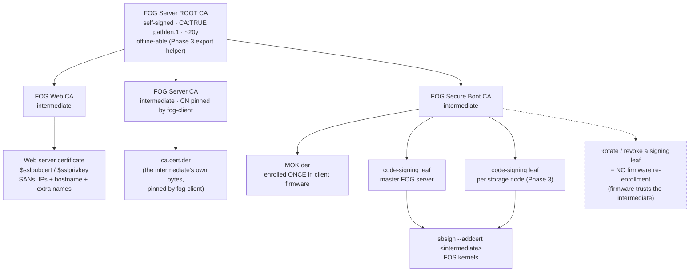
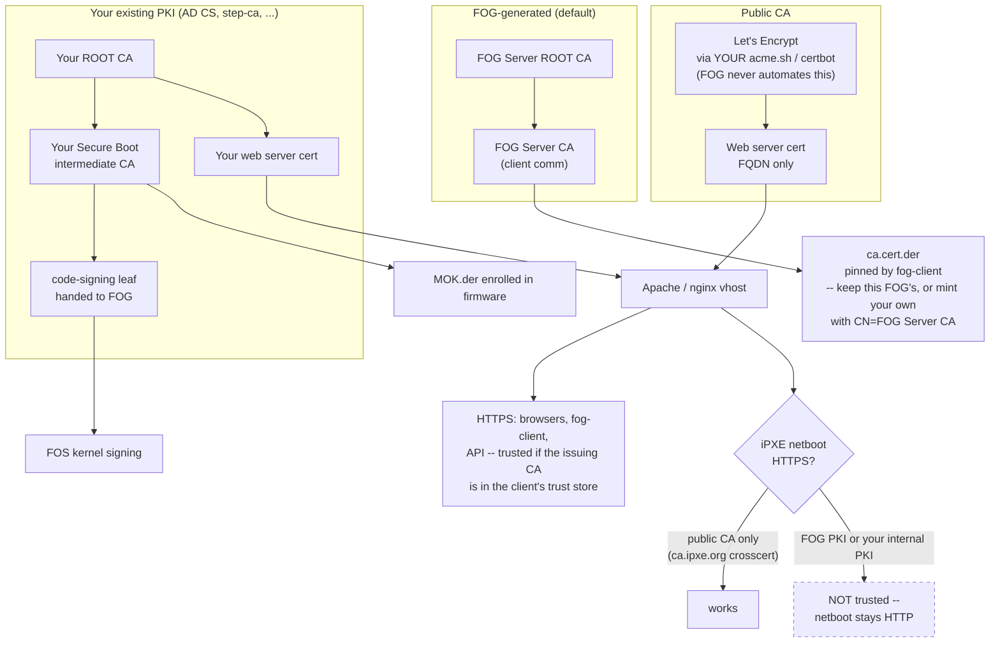
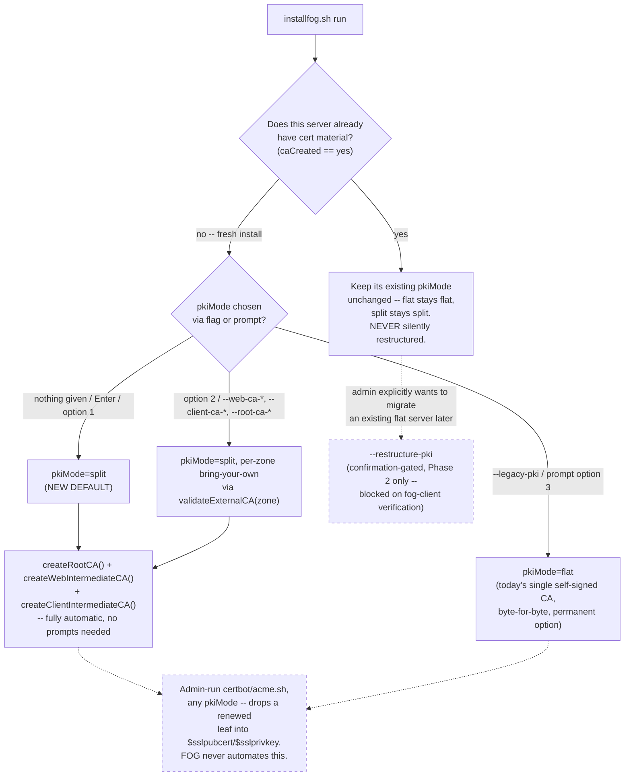

# Three-zone PKI separation (Web TLS / Client Communication / Secure Boot)

Part of [FOGProject/fogproject#1014](https://github.com/FOGProject/fogproject/pull/1014).

## Context

FOG's installer today mints exactly one self-signed CA (`createSSLCA()`,
`lib/common/functions.sh:3412-3534`, `.fogCA.key`/`.fogCA.pem`, default
CN="FOG Server CA" — literally the sixth answer in the `openssl req -x509`
heredoc at `functions.sh:3432-3440`, confirmed directly in code, not just
asserted by the maintainer) and uses it for two roles at once:

1. **Signs the web vhost's leaf cert** (`srvpublic.crt`, `$sslpubcert`) — what
   Apache/Nginx serves over HTTPS.
2. **Is exported verbatim as `ca.cert.der`/`ca.cert.pem`**
   (`functions.sh:3520-3521`) — what fog-client downloads from
   `/management/other/ca.cert.der` and pins. Per
   `docs/EXTERNAL_CA_AND_LETSENCRYPT.md`, fog-client does not do standard OS
   chain validation; it adds *only* this exact certificate to its trust store
   and requires the server's leaf to chain to it directly.

`--external-ca`/`--ca-cert`/`--ca-key`/`--ca-root` (`validateExternalCA()`,
`functions.sh:3271-3346`) already lets an admin swap role (1) for their own
intermediate — but because roles (1) and (2) still share one variable/file
(`$sslcapem`), swapping the web-signing CA **always** also swaps the
fog-client-trust CA.

Secure Boot is a **third** job, currently done by a keypair that is separate
from the flat CA but has its own, different structural problem:
`_ensureSecureBootKeys()` (`functions.sh:4625-4694`) generates
`$fogprogramdir/secureboot/MOK.{key,pem}` — **self-signed, `basicConstraints
CA:FALSE`**, CN="FOG Project Secure Boot Signing", `codeSigning` EKU —
independently of `$sslcapem`/`$sslcakey` entirely. `_resignKernels()`
(`functions.sh:5049-5094`) calls `sbsign --key "$secureBootKey" --cert
"$certpem"` directly against that self-signed leaf, and
`_publishSecureBootKit()` (`functions.sh:4781-4832`) publishes **the same
certificate** as `MOK.der` for enrollment into client firmware.

That double duty is the problem. Because the enrolled MOK *is* the signing
certificate, and it is a leaf that can issue nothing:

- Rotating or revoking the signing key means **physically re-enrolling every
  client** through MokManager — a firmware-level trip to each machine.
- A storage node cannot sign kernels at all without being handed the one and
  only signing private key that the entire fleet's firmware trusts.

So Secure Boot gets the same treatment as the other two zones in this
design: the Root CA issues a **FOG Secure Boot CA** intermediate, *that
intermediate's* public certificate becomes `MOK.der` (the thing enrolled in
firmware), and the intermediate issues short-lived **code-signing leaves** —
one for the master server, one per storage node. `sbsign` bundles the
intermediate alongside the leaf (`--addcert`) so shim can build the chain
back to what firmware trusts. Leaves can then be rotated, revoked, or issued
to new nodes with **no firmware re-enrollment**, and the bring-your-own story
becomes symmetric with the other zones: an admin issues their own
Secure-Boot intermediate from their own root and hands FOG a leaf.

This is a change from an earlier revision of this design, which scoped Secure
Boot out as "already separate, leave it alone." The isolation observation was
correct; the conclusion was wrong. Being separate from the *flat CA* is not
the same as being *well structured*, and the flat-leaf-as-MOK shape is what
makes Secure Boot key management operationally painful today.

**This restructuring carries the highest endpoint cost of any zone in this
design** (firmware re-enrollment, per the maintainer's own trust-zone table)
and therefore applies to **fresh installs only**; an existing server's
already-enrolled MOK is never regenerated or replaced — see Backward
compatibility and Open Risks.

### The coupling that actually needs fixing (found during this design, not
### assumed from the maintainer's brainstorm)

`certDecrypt()` (`fogbase.class.php:2011-2049`) is called from exactly one
place: `FOGPage::authorize()` (`fogpage.class.php:2712` ff.), which runs on
every fog-client checkin authorization handshake. It decrypts the client's
freshly-generated session material (`sym_key`, `token`) using
`openssl_private_decrypt()` against `.srvprivate.key` read straight off disk —
literally `$sslprivkey`, the same file `createSSLCA()` writes as the vhost
leaf's private key, and (until it is removed — see Non-goals) the same file
`bin/setupacme.sh --install-cert --key-file "$sslprivkey"` **overwrote on
every ACME leaf renewal**.

So: only the client→server direction is coupled to the vhost's own TLS
keypair, but it is coupled *by file identity*, not just by CA. A genuine
"Client Communication" trust zone needs **its own dedicated leaf keypair**,
not just its own CA, decoupled from whatever the vhost's TLS listener is
currently using. This is the single most important correction this design
makes to the maintainer's brainstorm: "give Client Communication its own CA"
is necessary but not sufficient; `certDecrypt()`'s key source must also move
off `$sslprivkey`.

#### What is proven, and the one thing that is not

Proven from this repo's code, no inference involved:

- `.srvprivate.key` is generated by `openssl genrsa -out $sslprivkey`
  (`functions.sh:3478`) as a **separate keypair from the CA**
  (`functions.sh:3431`), and its public half is what ends up in
  `srvpublic.crt` — the CSR at `:3492` is built from it and signed by the CA
  at `:3515`. It is the **web server leaf key**.
- `ca.cert.pem`/`ca.cert.der`, the files fog-client downloads, are a copy of
  `$sslcapem` — the **CA certificate** (`functions.sh:3520-3521`).
- `certDecrypt()` reads `<storagenode.sslpath>/.srvprivate.key`
  (`fogbase.class.php:2034-2042`) and RSA-decrypts with it
  (`openssl_private_decrypt`, `:2065`).
- `authorize()` calls it on every fog-client handshake to recover `sym_key`
  and `token` (`fogpage.class.php:2730`).

**Confirmed on a live server:** `.srvprivate.key` is present and is the web
leaf's key. (An earlier round of this discussion suspected the file was
absent entirely — every file in `$sslpath` is a **dotfile**, so a bare `ls`
shows only `fog.csr`, `req.cnf` and `ca.cnf` and makes the directory look
empty of key material. `ls -la` shows otherwise.) **The coupling is real**:
the private key backing the web server's TLS certificate is also the key
that decrypts every fog-client authorization handshake, and any process
that legitimately replaces the web leaf — an ACME renewal, a `--recreate-keys`
run, dropping in a purchased certificate — silently breaks client
authentication.

So the fix is the one the maintainer describes: **the FOG Server CA issues
its own communication TLS certificate.** Same principle as the other zones,
just one more leaf — one that is never shared with the web vhost.
`certDecrypt()` reads that leaf's key; the vhost keeps using its own. Two
independently replaceable certificates where today there is one file doing
both jobs.

**The one remaining unknown is narrower, and it is about delivery, not
design:** how does fog-client obtain the public key it encrypts with? The
evidence says it is *not* the CA — the CA and leaf are different keypairs
and RSA cannot decrypt across a mismatch — yet the client demonstrably
works over plain HTTP, so it is not reading the key off a TLS handshake
either. The most probable answer is that it fetches the leaf certificate
that `createSSLCA()` deliberately publishes into the **web-served**
directory at `$webdirdest/management/other/ssl/srvpublic.crt`
(`functions.sh:3509,3518`) — sitting right next to the `ca.cert.der` it
pins, which is exactly where a client would look for both halves of this
scheme.

If that is right, this decoupling needs **no fog-client change at all**:
the comm leaf simply gets published at the path the client already fetches,
while the vhost's own certificate moves to the Web zone's path. That would
be the ideal outcome, and it is plausible enough to design toward — but it
is precisely the kind of cross-repo assumption the `certDecrypt()` finding
itself proves is worth checking rather than inheriting. Phase 0 Task 0.3
confirms the fetch path before Task 1.4 is written.

### Sanity-checking the CN-pinning claim

The maintainer states fog-client hardcodes an expectation around the pinned
cert's CN ("FOG Server CA"), does not do standard OS chain validation, and
that a replacement intermediate CN must match exactly for existing client
binaries to keep working without a source change. **This repo contains no
fog-client/zazzles source — this claim cannot be verified here.** What *can*
be verified, and is a meaningful data point: the existing self-signed default
(`functions.sh:3438`) has always minted its CA with `CN=FOG Server CA` — this
is not new information invented for this design; it is what every stock FOG
install has produced for years. That is circumstantial support that
*something* about that literal string matters, but it does not distinguish
between two very different pinning mechanisms with very different migration
consequences:

- **Byte-identical whole-certificate pinning** (what
  `docs/EXTERNAL_CA_AND_LETSENCRYPT.md:60-68` explicitly describes today:
  "the client adds *only* `ca.cert.der`... and requires that exact certificate
  to appear in the server's chain") — CN is irrelevant to the check; a
  same-CN *replacement* cert with a new key is just as untrusted as a
  different-CN one, until the client re-pins the new bytes.
- **CN-substring/string matching** — a replacement cert with the same CN
  might be accepted by some validation paths without the client ever fetching
  new bytes, which would be a much weaker (and frankly, surprising) model for
  a security control, but is what the maintainer's comment literally
  describes ("could be swappable as long as the CN of whatever intermediate
  you issue has CN='FOG Server CA'").

**This design treats the distinction as unresolved and requires it be
verified against the actual `zazzles`/fog-client source before Phase 2 (the
client-facing rotation work) starts** — see Task-Plan Phase 0. Critically,
the blast radius of guessing wrong is contained to exactly **one** place: a
single shell variable, `$fogClientCACN` (default `"FOG Server CA"`), defined
once in `lib/common/functions.sh` and referenced everywhere a client-CA
subject is written or validated. No function hardcodes the literal string a
second time. If verification finds the real requirement is a different
string, a different field (O instead of CN), or "byte-identical only, CN is
irrelevant" — the fix is confined to that one definition and the one
validation call site described in Components below, not scattered across
`createClientIntermediateCA()`, `validateExternalCA()`, docs, and CLI help
text independently.

## Non-goals

- Not re-enrolling, rotating, or invalidating any **already-enrolled** Secure
  Boot MOK. An existing server keeps its current self-signed MOK keypair
  untouched forever (`_ensureSecureBootKeys()`'s existing "never regenerate"
  guarantee is preserved verbatim); the intermediate model applies to fresh
  installs only. There is deliberately **no** migration path offered for
  Secure Boot equivalent to Phase 2's fog-client re-pinning — the remedy for
  an existing server that wants the new structure is to enroll the new
  intermediate as an *additional* MOK, which is a documented admin
  procedure, not an installer action.
- Not issuing per-storage-node Secure Boot leaves **automatically** in Phase
  1. The intermediate model makes per-node leaves *possible* (and that is a
  primary reason for adopting it); actually provisioning them across nodes
  needs the storage-node install path and the node-registration flow to carry
  a CSR round-trip, which is its own scoped work — see Phase 3.
- Not extending per-location protocol/PKI selection into the Location plugin.
  That plugin already has a per-location `protocol` override
  (`packages/web/lib/plugins/location/hooks/changeitems.hook.php:118`) that
  this design's protocol work should stay compatible with, but multi-site
  PKI is explicitly later work.
- Not modifying `zazzles`/fog-client source. Nothing in this design can be
  implemented against real fog-client binaries without that repo's
  cooperation for the CN-verification step and (if the pessimistic case in
  Open Risks holds) a client-side "re-fetch and re-pin without a full
  re-register" capability that may not exist today.
- Not forcing any existing install through this restructuring.
  `updatefog.sh`'s default in-place update path is unchanged for every server
  that does not explicitly opt in — this applies to servers that already
  have cert material (`caCreated == yes`). It does **not** apply to fresh
  installs: those now default to `split` (see Architecture/Components) — a
  deliberate default change, not an exception to this non-goal.
- Not making the legacy flat-CA mode second-class or transitional.
  `--legacy-pki` (or the interactive prompt's legacy choice) produces exactly
  today's single self-signed CA, byte-for-byte. It is a permanent, fully
  supported, lower-overhead alternative for admins who don't want the
  three-zone split, not a deprecated fallback being phased out.
- Not re-litigating `--extra-server-name`/`--hostname` — those are
  already-merged, additive, and orthogonal; this design builds around them
  without changing their behavior.
- **Removing `bin/setupacme.sh` entirely — ACME/Let's Encrypt automation is
  not a FOG-managed feature, full stop, not even in its current
  already-merged, CA-only-touching form.** On reflection (this was
  reconsidered mid-design, not the original plan), FOG should not own any
  ACME client integration at all. It is simple enough for an admin who wants
  a renewing/public certificate to run `certbot`/`acme.sh` themselves and
  drop the resulting cert/key into the Web zone's leaf paths (`$sslpubcert`/
  `$sslprivkey`) — a safe drop-in once the paired customization-preservation
  design's managed-block vhost splice has landed (see
  `docs/superpowers/specs/2026-08-07-customization-preservation-design.md`),
  because FOG's vhost regeneration will never clobber it. `bin/setupacme.sh`
  is deleted as part of this design (Task-Plan Phase 1, Task 1.6), and
  `docs/EXTERNAL_CA_AND_LETSENCRYPT.md`'s "Automating renewal with
  setupacme.sh" subsection is replaced with this self-service guidance in the
  new `docs/PKI_ZONES.md`. A future FOG **plugin** offering a GUI-level
  "enable Let's Encrypt" toggle is a plausible later feature once the
  three-zone split has settled and proven itself — explicitly out of scope
  for this design, noted only as a forward-looking possibility in Open
  Risks, not designed toward now.
- Not deprecating `--external-ca`/`--ca-cert`/`--ca-key`/`--ca-root` this
  release. They are reinterpreted as "the web zone's" import flags (their
  exact current behavior, unchanged), with new `--client-ca-*` flags added
  alongside for the new zone. A deprecation timeline is a Phase 3 decision,
  not a Phase 1 one.
- Not designing FOG's separate, publicly-managed installer-signing CA
  (expires 2029, used by fog-client auto-update to verify installer
  signatures) — explicitly out of scope per the maintainer's own note.

## Architecture

### Directory layout

Everything new lives under the existing `$sslpath`
(`$fogprogramdir/snapins/ssl` by default — already outside `$webdirdest`,
already survives whatever `configureHttpd()` does to the web docroot, exactly
like `$fogprogramdir/secureboot` already does for MOK). Nothing under the
*existing* flat layout (`$sslpath/CA/.fogCA.{key,pem}`,
`$sslpath/CA/.fogCAchain.pem`, `$sslpath/.srvprivate.key`,
`$sslpath/fog.csr`) is renamed, moved, or deleted by this design. The new tree
is additive, in sibling directories that simply do not exist until an admin
opts in:

```
$sslpath/
  CA/
    .fogCA.key / .fogCA.pem / .fogCAchain.pem   # UNCHANGED flat-mode files;
                                                 # present forever, used only
                                                 # when $pkiMode != split
    root/
      .fogRootCA.key   # 0600 root:root; documented offlining path, not
                        # required from day one -- see Components
      .fogRootCA.pem   # CN "FOG Server ROOT CA", CA:TRUE, pathlen:1, ~20y
      .fogRootCA.srl
    web/
      .fogWebCA.key
      .fogWebCA.pem        # CN "FOG Web CA" (or admin's own import)
      .fogWebCAchain.pem    # root + web intermediate (+ admin's own root,
                             # if --web-ca-root was used instead of FOG's root)
    client/
      .fogClientCA.key
      .fogClientCA.pem      # CN "$fogClientCACN" (default "FOG Server CA")
                             # -- issues NOTHING itself. This cert's own bytes
                             # are exactly what's exported as ca.cert.der.
      comm/
        .commLeaf.key       # THE fix for the certDecrypt() coupling above.
        .commLeaf.pem        # Leaf issued BY .fogClientCA, never touched by
                             # a web-TLS recreate. authorize()/certDecrypt()
                             # point here, not at $sslprivkey.
  .srvprivate.key / fog.csr   # UNCHANGED flat-mode files (symlink targets)
```

The Secure Boot zone stays in its existing home, `$fogprogramdir/secureboot/`
— it is not moved under `$sslpath`. Two reasons: that directory is already
`0700 root:root` with a deliberate "the web user must never read this"
separation enforced through the `fog-sign-kernel` sudo helper
(`functions.sh:4650-4655`), and every existing install already has files
there that must keep working untouched. What changes is what lives beside
them in `split` mode:

```
$fogprogramdir/secureboot/
  MOK.key / MOK.pem      # flat/legacy: self-signed leaf, BOTH signer and
                          # enrolled MOK. UNCHANGED for existing installs.
  ca/
    .fogSBCA.key         # split: the FOG Secure Boot CA intermediate,
    .fogSBCA.pem          # issued by the Root. ITS cert becomes MOK.der.
    .fogSBCA.srl
  leaf/
    sign.key             # split: this server's short-lived code-signing
    sign.pem              # leaf, issued by .fogSBCA. What sbsign uses.
  nodes/                 # split, Phase 3: one issued leaf per storage node
  PK.key / PK.pem        # UNCHANGED -- platform keys, unrelated to this split
  KEK.key / KEK.pem      # UNCHANGED
```

### Diagram 1 — default FOG PKI (everything FOG-generated)



### Diagram 2 — drop-in options (mix and match per zone)

Each zone is independently replaceable. Nothing forces an admin to replace
all three, or any.



**Caveats the diagram encodes, stated plainly:**

- A FOG-PKI or internal-PKI web certificate **can** carry IP addresses and
  DNS aliases as SANs (this already works — `--extra-server-name` and the
  existing SAN loop), so HTTPS is trusted for browsers, fog-client, and API
  traffic on any of those names once the CA is in the client trust store.
  **It is still not trusted for iPXE netboot**, because iPXE has no path to
  that CA — its only fallback is the `ca.ipxe.org` cross-signing service,
  which only bridges *public* roots.
- **Let's Encrypt does work for Secure-Boot iPXE netboot**, but only on an
  FQDN in a domain you control (it need not be publicly reachable — DNS-01
  validation is enough), and **only on that exact FQDN** — not the short
  hostname, not an IP address. `FOG_WEB_HOST` must be set to that FQDN
  accordingly, which is what makes the generated boot URLs match the
  certificate. This is confirmed by ad-hoc testing, not just inference (see
  Open Risks).

`$sslpath/CA/root` holding the root **key** on-server is the *initial*
default (protect it with strict perms, document/nudge toward offlining,
provide an explicit command to do so) rather than requiring an offline
HSM/vault on day one, which would make the default install harder for the
common case with no security benefit for an admin who never intended to run
a real offline root anyway.

One nuance Diagram 1 deliberately simplifies: whether the Client
Communication intermediate issues a separate `.commLeaf` at all, or is
itself the comm keypair, depends on Phase 0's verification of fog-client's
behavior — the Client CA issues its own comm TLS certificate; only *where
that certificate is published* is still to be confirmed (Phase 0 Task 0.3).

### Zone → file/variable mapping

| Zone | CA files | Leaf/comm files | Consumed by |
|---|---|---|---|
| Web TLS | `$sslpath/CA/web/.fogWebCA.{key,pem}`, `.fogWebCAchain.pem` | `$sslpubcert`/`$sslprivkey` (unchanged names/paths — still what the vhost config writes and what an admin-managed ACME/certbot process drops a renewed cert into) | Apache/Nginx vhost, iPXE's `TRUST=` build, browsers |
| Client Communication | `$sslpath/CA/client/.fogClientCA.{key,pem}` | `$sslpath/CA/client/comm/.commLeaf.{key,pem}` | fog-client (pins `.fogClientCA.pem` as `ca.cert.der`; encrypts `authorize()` payloads against `.commLeaf.pem`'s public key); `certDecrypt()`/`certEncrypt()` (server side, reads `.commLeaf.key`) |
| Secure Boot (`split`) | `$fogprogramdir/secureboot/ca/.fogSBCA.{key,pem}` — its cert is published as `MOK.der` | `$fogprogramdir/secureboot/leaf/sign.{key,pem}` (master), `nodes/<node>.{key,pem}` (Phase 3) | `_resignKernels()` signs with the **leaf** + `--addcert` intermediate; mokutil/shim on endpoints enroll and trust the **intermediate** |
| Secure Boot (`flat`/legacy, and every existing install) | *(unchanged)* `$fogprogramdir/secureboot/MOK.{key,pem}` — self-signed leaf, both signer and enrolled MOK | — | `_resignKernels()`, mokutil/shim, exactly as today |

The Secure Boot rows are where the split is most visible in code: today a
single variable, `$secureBootCert`, is simultaneously *what signs kernels*
and *what gets enrolled in firmware*. In `split` mode those become two
different certificates — `$secureBootCert`/`$secureBootKey` keep their
meaning as **the signing leaf**, and a new `$secureBootMokCert` names **the
intermediate to enroll**. In `flat` mode the new variable simply points at
the same file as `$secureBootCert`, so every downstream consumer
(`_publishSecureBootKit()`, the enrollment kit, the Secure Boot web page)
reads one variable and behaves identically in both modes without branching.

The Client Communication zone publishes **two** files, mirroring what the
flat model already publishes side by side today:

- `ca.cert.der` — `.fogClientCA.pem`'s bytes, the pinned trust anchor.
  Unchanged export mechanics (`functions.sh:3520-3521`), new source file.
- The **comm leaf's** public certificate — what the client actually
  RSA-encrypts `sym_key`/`token` against. This is the file that replaces
  today's dual-purpose web leaf in the client-auth path.

Today those two roles are filled by `ca.cert.der` and
`management/other/ssl/srvpublic.crt` respectively, both already published
into the web-served `management/other/` directory. The decoupling keeps that
*shape* exactly — two files, same directory, same names — and changes only
which key material backs the second one: the comm leaf issued by the Client
CA, instead of the web vhost's TLS leaf. The vhost's certificate moves to
the Web zone and stops being web-published at all.

That is what makes this change plausibly invisible to fog-client: the
filenames and locations it fetches do not move, only the key behind one of
them. Confirming the client genuinely fetches that path (rather than
deriving a key from `ca.cert.der`) is Phase 0 Task 0.3's job — see Open
Risks. If it turns out the client does derive its encryption key from
`ca.cert.der` itself, the fallback is for `.fogClientCA` to double as the
comm keypair, which still achieves the decoupling from the web leaf, just
without a separate comm certificate.

### `--external-ca` reinterpreted

`--external-ca`/`--ca-cert`/`--ca-key`/`--ca-root` keep their exact current
behavior and become, unambiguously, **the Web zone's** import path (their
target directory moves from `$sslpath/CA/` to `$sslpath/CA/web/`, but nothing
about validation, chaining rules, or the CLI contract changes). New
`--client-ca-cert`/`--client-ca-key`/`--client-ca-root` flags, validated by
the *same* `validateExternalCA()` logic parameterized by zone
(`validateExternalCA web` / `validateExternalCA client`), let an admin bring
their own CA for the Client Communication zone instead — e.g. an AD CS
sub-CA, per the maintainer's "enterprise drop-in" scenario — with one extra
check this zone requires that Web does not: the imported cert's Subject CN is
compared against `$fogClientCACN` and a **loud warning** (not a hard failure
— an admin who knows what they're doing may be intentionally testing whether
the CN actually matters) is printed if it does not match. A third,
independent `--root-ca-*` set of flags (import or generate-and-later-export)
governs the Root, orthogonal to both.

### Choosing a scenario: CLI flags AND an interactive prompt

Every zone/import decision above is driven by a small, fixed set of staging
variables (`pkiMode`, and per-zone `--web-ca-*`/`--client-ca-*`/`--root-ca-*`
paths) — this shape is deliberately chosen so it can be populated two ways,
not just one:

- **Non-interactively**, via the CLI flags described above and in
  Task-Plan Phase 1 (for scripted/`-Y` installs, and for `updatefog.sh`
  pass-through).
- **Interactively, on a fresh install**, via a new prompt in
  `lib/common/newinput.sh`, gated exactly like the existing `hostname` prompt
  is (`lib/common/newinput.sh:17-35`): only runs when `pkiMode` isn't already
  set via a flag or a persisted `.fogsettings` value, and only under a real
  interactive session (never under `-Y`).

The prompt offers three scenarios in plain language — (1) split PKI with
FOG-generated root+intermediates, **the new default** (pressing Enter with no
answer selects this, matching the non-interactive default described under
Components below); (2) split PKI, bring-your-own CA per zone, which then
prompts for cert/key/root paths per zone the admin chooses to override,
reusing the exact same `validateExternalCA(zone)` validation the
non-interactive flags already run; (3) **legacy** — today's single
self-signed CA, byte-for-byte unchanged, offered as a permanent, explicit,
lighter-weight alternative, not a deprecated fallback. Selecting any of the
three simply populates the same `pkiMode`/`--*-ca-*` staging variables a flag
would — there is no separate code path for the interactive answer, it is
purely an alternate way to fill in the same variables, applied in the same
"after `.fogsettings` sourced" block every other staged value already uses.

This mirrors exactly how `hostname` already works today (prompted
interactively if not given via `--hostname`, silently reused from
`.fogsettings` on every later run) — no new pattern is introduced, this
design just extends that existing pattern to the PKI scenario choice, with a
sensible default pre-selected instead of requiring an explicit answer.



### Certificate path indirection: canonical paths, real files anywhere

Admins need certificates to live outside FOG's directories — `/etc/pki/...`,
`/etc/letsencrypt/live/...`, a mounted secrets volume. But the vhost, the
PHP side, and `sbsign` all need *stable* paths, or every path change becomes
a config rewrite. The resolution: **FOG always reads and writes canonical
paths; those canonical paths may be symlinks to wherever the real file
lives.** The vhost then never changes when an admin relocates a
certificate — which pairs directly with the paired
customization-preservation design's managed-block vhost, since a cert
relocation stops being a vhost edit at all.

**This mechanism already half-exists** and is worth completing rather than
inventing: `functions.sh:3497-3500` already links `$sslcakey`, `$sslcapem`,
`$sslcsr` and `$sslprivkey` into canonical `$sslpath` locations, precisely so
those variables can point elsewhere. Two problems with it as written:

- **Two of the four are broken.** Lines 3497-3498 test one path and link
  another:
  ```bash
  [[ ! -e $sslpath/.fogCA.key ]] && ln -sf $sslcakey $sslpath/CA/.fogCA.key
  ```
  The guard checks `$sslpath/.fogCA.key`; the link is created at
  `$sslpath/CA/.fogCA.key`. On a default install `$sslcakey` *is*
  `$sslpath/CA/.fogCA.key`, so this reduces to `ln -sf X X` — GNU `ln`
  refuses ("are the same file") and logs to `$error_log`, so it is harmless
  today, but the intended canonical link at `$sslpath/.fogCA.key` is never
  created. Lines 3499-3500 (`fog.csr`, `.srvprivate.key`) test and link the
  same path and are correct.
- **It is driven only by `.fogsettings`**, not by anything an admin can set
  without SSH.

What this design adds:

1. **Fix the two mismatched guards** so all four canonical links behave
   consistently, and extend the same pattern to every new path this design
   introduces (the three intermediates, the SB leaf, `.commLeaf`).
2. **Keep FOG's own consumers pointed exclusively at canonical paths.** The
   vhost, `_resignKernels()`, `_publishSecureBootKit()`, and `certDecrypt()`
   all reference the canonical location; whether that is a real file or a
   symlink is invisible to them. An admin dropping a renewed Let's Encrypt
   certificate in place either writes to the canonical path or points the
   symlink at their own — both work, neither touches the vhost.
3. **Surface the paths as settings.** Note that one already is:
   `certDecrypt()` resolves its directory from the **storage node's `sslpath`
   database column** (`fogbase.class.php:2019-2023`), which is already
   GUI-editable on the Storage Node form (`SSLPath`,
   `packages/web/commons/text.php:311`). That is the precedent to follow —
   `.fogsettings` stays the installer's source of truth, and the
   GUI-visible values are records of it, exactly as `FOG_GIT_PATH` and
   `FOG_EXTRA_SERVER_NAMES` already are.

**Caveats to document rather than discover:** a certificate outside the
distro's expected directories may be blocked by SELinux even through a
symlink (the *target's* context is what matters, not the link's) — an admin
relocating certs on a RHEL-family box may need `restorecon`/`semanage
fcontext` on the real path. And the private key's ownership and mode must
survive relocation: `_ensureSecureBootKeys()`'s `0600 root:root` and the
`fog-sign-kernel` sudo helper's separation model assume the web user cannot
read the key, and a symlink into a world-readable location silently defeats
that.

### Protocol selection: HTTPS everywhere vs. netboot-stays-HTTP

Which PKI backs the **web** certificate determines how much of FOG can
safely be HTTPS, because iPXE's trust story is narrower than every other
consumer's:

| Web cert issued by | Web UI / API / fog-client | iPXE netboot (`boot.php`, kernel, init) | `httpproto` default |
|---|---|---|---|
| **Public CA** (Let's Encrypt et al.) | HTTPS — natively trusted | **HTTPS works** via iPXE's `ca.ipxe.org` crosscert, FQDN only | `https` everywhere (today's behavior) |
| **FOG PKI** (this design's default) | HTTPS once the FOG root is in the client trust store; SANs may include IPs and aliases | **Not trusted** — no crosscert path for a private root | `https` for web, **`http` for netboot** |
| **Your internal PKI** (AD CS, step-ca) | HTTPS once your root is in the client trust store | **Not trusted** — same reason | `https` for web, **`http` for netboot** |

Today `httpproto` is a single global that forces all of these together,
which is why enabling HTTPS with a private CA historically meant rebuilding
iPXE with `TRUST=` baked in (`configureTFTPandPXE()`,
`functions.sh:1202-1215`) — and that rebuild is exactly what forfeits the
signed Secure Boot shim. Splitting the two lets a FOG-PKI or internal-PKI
server have a properly trusted HTTPS web UI **and** keep the stock signed
shim, at the cost of netboot fetches staying on HTTP (a pre-boot
environment on a provisioning VLAN — an acceptable trade, and the same
exposure as today's default HTTP install).

**What makes this cheap to implement** — a finding from tracing the code
rather than an assumption: `FOGBase::$httpproto`
(`packages/web/lib/fog/fogbase.class.php:481-483`) is derived from **the
current request's** `$_SERVER['HTTPS']`, not from a stored setting. Every
boot-menu URL `bootmenu.class.php` emits (`:286` `$this->_web`, `:292`
`boot-url`, `:458` `$this->_booturl`) inherits the protocol iPXE actually
connected with. So if iPXE reaches `boot.php` over HTTP, the entire
generated menu — kernel and init fetches included — is already HTTP, with
**no PHP change required**. Only two things must change:

1. **`configureDefaultiPXEfile()`** (`functions.sh:1037-1042`) writes the
   `chain ${httpproto}://...boot.php` line. It must use a new, separate
   `$netbootproto` variable rather than `$httpproto`.
2. **The vhost's HTTP→HTTPS redirect** (the `$httpproto == https` branches,
   `functions.sh:3571` nginx / `:3814` Apache) must **exclude** the netboot
   paths (`${webroot}service/ipxe/`), or the redirect drags iPXE straight
   back onto HTTPS and defeats the whole arrangement. This exclusion is the
   one genuinely fiddly piece of the change and needs testing on both
   webserver families.

`$netbootproto` is a new managed key defaulting to `http` when `pkiMode ==
split` (or when a private CA is imported for the web zone) and to
`$httpproto` when the web cert comes from a public CA. An admin can override
it explicitly in either direction — including forcing `https` netboot on a
private CA, which is legitimate if they *also* accept an iPXE rebuild and
the loss of the signed shim (the pre-existing trade-off, now an explicit
choice rather than an implicit consequence of one global).

## Components

### `pkiMode` (new managed key, `flat` | `split`)

Gate for every new code path in this document. The default is computed, not
a fixed constant — it depends on whether this server already has cert
material:

- **No existing CA yet (`caCreated` not `yes`) — a genuinely fresh
  install:** defaults to **`split`**. This is the new default as of this
  design — a fresh install gets the three-zone PKI automatically, with no
  flag or prompt answer needed. `--legacy-pki` (non-interactive) or the
  interactive prompt's legacy choice opts back into `flat` — today's single
  self-signed CA, byte-for-byte — as a permanent, fully supported,
  lighter-weight alternative, not a deprecated fallback (see Non-goals).
- **An existing CA already exists (`caCreated == yes`) and `.fogsettings`
  has no `pkiMode` key:** this server predates this feature. Defaults to
  **`flat`**, matching its actual current state exactly — this design never
  silently restructures an existing install's PKI, regardless of what a
  fresh install would now default to. `--restructure-pki` remains available
  as the explicit, confirmation-gated opt-in to migrate such a server (see
  Phase 2) — it is no longer needed or documented as a fresh-install flag,
  since a fresh install reaches `split` by default without it.
- **`pkiMode` already persisted in `.fogsettings`** (either value, from a
  prior run under this feature): reused unchanged, exactly like every other
  managed key.

Once resolved (by either default path or an explicit override), every later
`installfog.sh`/`updatefog.sh` run on that server stays in the same mode
(managed key, same persistence pattern as `caCreated`).

### `createRootCA()` (new function, sits beside `createSSLCA()`)

Self-signed only (no import path at this level beyond `--root-ca-cert/-key`,
which simply skips generation and copies in an admin-supplied root instead,
mirroring `_ensureSecureBootKeys()`'s "admin-supplied pair always wins, never
regenerated" pattern). `CN=FOG Server ROOT CA`, `basicConstraints=critical,
CA:TRUE,pathlen:1`, ~20y validity; a root need not match the intermediates'
shorter, more frequently-rotated lifetimes. Never regenerates once present,
same reasoning and same code shape as `_ensureSecureBootKeys()`'s doc comment
about why MOK never regenerates — copy that reasoning here nearly verbatim,
it applies identically.

### `createWebIntermediateCA()` / `createClientIntermediateCA()` (new
functions)

Both share one small helper, `_issueIntermediateCA(cn, outdir, keyfile,
certfile)`, that does `openssl genrsa` + `openssl req -new` + `openssl x509
-req -CA $rootcapem -CAkey $rootcakey -CAcreateserial -extensions v3_intermediate_ca`
against the Root — the same shape `createSSLCA()`'s existing self-signed
branch already uses, just with `-CA`/`-CAkey` added and `basicConstraints
CA:TRUE` in the extfile instead of the leaf's `CA:FALSE`. `createWebIntermediateCA()`
takes over the CSR/leaf-signing logic that lives in the back half of today's
`createSSLCA()` (lines 3445-3517: CSR, `sanentries`/`dnsSanEntries`,
`ca.cnf`, `openssl x509 -req -CA $sslcapem ...`), pointed at the web
intermediate instead of `$sslcapem`. `createClientIntermediateCA()` is new:
it either (a) generates `.fogClientCA.{key,pem}` from the root with
`CN=$fogClientCACN`, publishes it as `ca.cert.der`/`ca.cert.pem` exactly as
`createSSLCA()`'s existing two lines already do (`functions.sh:3520-3521`,
unchanged mechanics, new source file), and — pending the Phase-0
verification's answer — either generates `.commLeaf.{key,pem}` signed by it
(if fog-client wants a real leaf) or skips that step and reuses
`.fogClientCA.{key,pem}` directly as the comm keypair (if fog-client expects
`ca.cert.der` itself to be usable as the encryption key, matching today's
flat model's shape); or (b) imports an admin-supplied client CA via
`--client-ca-*`, running the CN-mismatch warning described above.

### `certDecrypt()`/`certEncrypt()` re-pointing (PHP, minimal diff)

`fogbase.class.php:2027-2032`'s hardcoded `.srvprivate.key` filename becomes
a lookup for whatever file the *Client Communication* zone published as its
comm private key (`.commLeaf.key`, or `.fogClientCA.key` per the Phase-0
answer) — resolved the same way the existing code resolves
`sslpath`/`storagenode`, i.e. still via `Route::getIds('storagenode', [],
'sslpath')`, just appending a different, new-in-`split`-mode filename instead
of `.srvprivate.key` when `$pkiMode == split` (the storage node's `sslpath`
column is itself unchanged; only which filename under it gets opened
changes). In `flat` mode this function's behavior is byte-for-byte identical
to today — same file, same path, same failure modes.

### `createSecureBootIntermediateCA()` (new) + `_ensureSecureBootKeys()` (gated)

`createSecureBootIntermediateCA()` uses the same `_issueIntermediateCA()`
helper as the other two zones, with `CN=FOG Secure Boot CA`, writing to
`$fogprogramdir/secureboot/ca/`. It then issues this server's code-signing
**leaf** into `secureboot/leaf/` with the `codeSigning` EKU and
`basicConstraints CA:FALSE` — i.e. exactly the extension profile
`_ensureSecureBootKeys()` already writes into its `mok.cnf`
(`functions.sh:4660-4673`), just signed by the intermediate instead of
self-signed. Leaf validity is deliberately short (~1 year) because rotating
it no longer costs a firmware trip; the intermediate matches the root's long
horizon.

`_ensureSecureBootKeys()` gains a `pkiMode` gate at its top and **keeps its
entire existing body as the `flat` branch, unmodified** — including its
"admin-supplied pair always wins" check and its never-regenerate guarantee,
whose doc comment (`functions.sh:4620-4624`) explains precisely why a fresh
key silently strands every already-enrolled machine. That reasoning is what
makes the fresh-installs-only scoping non-negotiable: this design must never
cause an existing server to mint a new MOK.

In `split` mode it instead calls `createSecureBootIntermediateCA()` and sets:

- `secureBootKey`/`secureBootCert` → the **leaf** (`secureboot/leaf/sign.*`)
- `secureBootMokCert` → the **intermediate** (`secureboot/ca/.fogSBCA.pem`)

In `flat` mode `secureBootMokCert` is simply assigned the same path as
`secureBootCert`, so downstream consumers never branch.

`_ensureSecureBootPlatformKeys()` (PK/KEK) is genuinely unchanged — those
authorize firmware variable updates and sign nothing that executes; they are
orthogonal to this hierarchy.

### `_resignKernels()` — sign with the leaf, ship the chain

Two changes to `functions.sh:5049-5094`, both small:

- `sbsign` gains `--addcert "$secureBootMokCert"` when `pkiMode == split`, so
  the signed PE carries the intermediate and shim can chain the leaf back to
  the enrolled MOK. Without this the kernel is signed by a certificate the
  firmware has never seen and will not boot — this flag is the entire
  mechanism that makes leaf rotation free.
- The idempotency check `sbverify --cert "$certpem"` (`:5073`) keeps working
  unchanged, since it verifies against the signing leaf, which is still what
  produced the signature. Worth an explicit test rather than an assumption
  (see Testing) — a `sbverify` that resolves the chain differently would
  cause every run to re-sign, which is wasteful but not dangerous.

### `_publishSecureBootKit()` — publish the intermediate, not the signer

`functions.sh:4781-4832` currently converts `$secureBootCert` to DER and
publishes it as `MOK.der`. The only change is that it reads
`$secureBootMokCert` instead. In `flat` mode that is the same file it reads
today (identical output); in `split` mode it publishes the intermediate,
which is the certificate that must be enrolled. Everything else in that
function — the DER/PEM auto-detection, the MokManager binary staging, the
404 `index.php` guard, the permissions — is untouched.

The enrollment UX (`packages/secureboot/fog-enroll-mok.sh`, the PXE "Enroll
Secure Boot Key" menu item) needs **no change at all**: it fetches and
enrolls whatever is at `MOK.der`. It simply enrolls a CA now rather than a
leaf.

## Data flow

**Fresh install, the new default (no flag needed) or the interactive
prompt's split-related answers:**
`installfog.sh` → `caCreated` not yet `yes` → `pkiMode` resolves to `split`
→ `createRootCA()` → `createWebIntermediateCA()` (or
`--external-ca`/`--ca-cert`/... imports the web zone instead, unchanged
mechanics) → `createClientIntermediateCA()` (or `--client-ca-*` imports it)
→ vhost/leaf written under Web zone as today → `ca.cert.der` published from
the Client zone's CA cert → `_ensureSecureBootKeys()` takes its `split`
branch: `createSecureBootIntermediateCA()` mints the SB intermediate plus
this server's signing leaf → `_resignKernels()` signs FOS kernels with the
leaf and `--addcert`s the intermediate → `_publishSecureBootKit()` publishes
the **intermediate** as `MOK.der` → `$netbootproto` resolves to `http`
(private CA) or follows `$httpproto` (public CA) → all new managed keys
written to `.fogsettings`.

**Fresh install, `--legacy-pki` or the interactive prompt's legacy answer:**
`installfog.sh` → `pkiMode` resolves to `flat` → `createSSLCA()` runs its
existing, completely unmodified code path, producing exactly what a
pre-this-design install would have produced.

**Existing server, no opt-in (the overwhelming common case for
`updatefog.sh` — a server with `caCreated == yes` from before this feature
existed):** `.fogsettings` has no `pkiMode` key → resolves to `flat` (per
Components' `caCreated`-based default, not merely "unset defaults to flat")
→ `createSSLCA()` runs its existing, completely unmodified code path.
Nothing under `$sslpath/CA/root|web|client` is ever created, read, or
referenced. The existing `.fogCA.{key,pem}` stays exactly as valid as it was
before this patch merged — no other CA in this design shares its CN or its
file path, so there is no naming collision, and no code path introduced by
this design ever runs for a `flat`-mode server.

**Existing server, explicit opt-in (`installfog.sh --restructure-pki` run by
hand against an already-installed server):** see Task-Plan Phase 2 for the
full task sequence — this is the dual-trust-window migration.

**Web TLS renewal (steady state, any mode, admin-managed):** admin runs
whatever ACME client (`certbot`, `acme.sh`) or internal-CA process they
choose, on their own schedule, entirely outside FOG's process. The renewed
cert/key are dropped in at `$sslpubcert`/`$sslprivkey` — a safe drop-in
because the paired customization-preservation design's vhost managed-block
splice never touches leaf file *contents*, only the vhost config's reference
to their paths. FOG has no visibility into or role in this renewal at all.

## Error handling

- `createRootCA()`/the two intermediate functions inherit the same
  `errorStat $?` convention every other cert-generating function in
  `functions.sh` already uses — a failure here is fatal to the install run,
  consistent with how a `createSSLCA()` failure is fatal today.
- `validateExternalCA(zone)`'s existing three checks (key/cert match, CA:TRUE,
  chains to root) are unchanged and now simply run once per zone that opts
  into external import, writing to that zone's subdirectory instead of the
  shared one.
- The Client-zone CN mismatch is a **warning**, not a hard failure — see
  Components. A hard failure here would block a legitimate "I want to test
  whether the CN actually matters" run, which is exactly the kind of run that
  needs to happen before this ships to confirm or refute the maintainer's
  claim.
- `--restructure-pki` against a server that already has registered
  fog-clients requires an explicit, unskippable confirmation (even under
  `-Y`/`--autoaccept` — this is the one place in this design that
  deliberately does *not* follow `-Y`'s "never prompt" convention, because
  the consequence is fleet-wide and not reversible by re-running the
  installer) unless a new `--i-understand-this-will-require-client-repinning`
  style explicit flag is also passed. Exact flag name and prompt wording is
  an implementation detail for Task-Plan Phase 2, Task 2.1.

## Testing

Same posture as every other shell-script change in this repo: no CI beyond
`fogproject-install-validation`'s distro matrix, so verification is manual —
`bash -n` after every edit, then real installer runs on a test VM.
Additionally, because this design's Phase 2 hinges on an unverified
assumption about fog-client:

- **Phase 0 must produce a written, falsifiable answer** (from zazzles source
  or from the maintainer directly) to: does fog-client (a) pin by exact
  certificate bytes, (b) additionally/instead check the CN string, and (c)
  re-fetch/re-validate `ca.cert.der` and its leaf before every `authorize()`
  handshake, or only at registration time? All of Phase 2's task sequence in
  the plan below is written for the *pessimistic* answer to (c) (full
  re-registration required); if the real answer is optimistic, Phase 2
  collapses to something much simpler, which is a good problem to have but
  should not be assumed.
- **Phase 0 must also verify shim's chain-validation behavior on real
  hardware**, and this is a hard gate on the Secure Boot zone specifically:
  does the shim version FOG ships actually accept a kernel signed by a leaf
  whose issuing CA is the enrolled MOK, with the intermediate supplied via
  `sbsign --addcert`? The whole "rotate leaves without re-enrolling firmware"
  premise rests on this. It is well-established that shim supports CA
  certificates in MokList, but behavior varies across shim versions and
  firmware implementations, and this is exactly the sort of cross-project
  assumption that the `certDecrypt()` finding proves is worth checking rather
  than inheriting from a brainstorm. Test matrix: at least one x86_64 UEFI
  machine and one arm64 if available, on the shim build
  `downloadipxesecureboot()` stages. **If this fails, the Secure Boot zone
  falls back to today's self-signed-leaf model** (`flat` behavior) while Web
  and Client keep their split — the zones are independent by construction, so
  a negative result costs one zone, not the design.
- **Netboot protocol isolation** needs its own end-to-end test on both
  webserver families: with `pkiMode=split` and a FOG-PKI web cert, confirm
  (1) the web UI is HTTPS, (2) `default.ipxe` chains over HTTP, (3) the
  vhost's redirect does **not** bounce `service/ipxe/` to HTTPS, and (4) the
  boot menu `boot.php` generates carries HTTP kernel/init URLs — which should
  follow automatically from `$httpproto` being request-derived, but is the
  assumption most worth confirming empirically since the whole
  no-PHP-change claim rests on it.
- **Three checks together are the highest-value test in this entire
  change**, and should be verified as a set right after Task 1.3 lands,
  before any of Phase 1's remaining tasks are trusted:
  1. An **existing** `flat`-mode server (real prior `.fogsettings`,
     `caCreated == yes`, no `pkiMode` key) behaves identically to before
     this change on every `installfog.sh`/`updatefog.sh` run —
     `--external-ca` included.
  2. A **fresh** install with **no PKI-related flag at all** now produces
     `split` mode by default. This is a deliberate, new, *expected*
     behavior change from before this design, not a regression — verify it
     is actually happening, not just assumed.
  3. A **fresh** install with `--legacy-pki` (or the interactive prompt's
     legacy choice) reproduces today's pre-split flat behavior
     byte-for-byte — the regression test for the "permanent, supported
     lightweight option" promise in Non-goals.
- **Removing `bin/setupacme.sh` (Task 1.6) needs its own regression check**:
  confirm no other script/doc references it after removal (grep the repo for
  `setupacme` post-deletion) and that `docs/EXTERNAL_CA_AND_LETSENCRYPT.md`'s
  replacement guidance is accurate against a real `certbot`/manual-`acme.sh`
  drop-in test.

## Open risks/unknowns

1. **fog-client's exact pinning mechanism (byte-identical vs. CN vs. both) is
   unverified.** Blast radius is contained to `$fogClientCACN` and the one
   `validateExternalCA client` call site (see Architecture); nothing else
   hardcodes an assumption about it.
2. **Whether fog-client re-fetches/re-validates its pinned cert and leaf on
   every handshake, or only at registration, is unverified.** This determines
   whether Phase 2's client migration is a mostly-automatic background
   self-heal or a mandatory full re-registration per endpoint. The plan below
   is written for the pessimistic case.
3. **Where fog-client fetches the server's encryption certificate is
   unverified** (Phase 0 Task 0.3). The design is settled — the Client CA
   issues its own comm TLS certificate — but if the client fetches
   `management/other/ssl/srvpublic.crt`, publishing the comm leaf there
   makes this a server-side-only change, whereas if it derives its
   encryption key from `ca.cert.der`, the fallback is for the Client CA to
   double as the comm keypair. Only a third outcome (the client wanting a
   genuinely new path) would require `zazzles` work, and that is the least
   likely of the three.
   **Resolved and no longer open:** whether `.srvprivate.key` exists and
   which certificate it backs. It exists (dotfile, invisible to a bare
   `ls`), it is the web leaf's key, and `certDecrypt()` uses it — so
   replacing the web certificate breaks client auth today. That is the bug
   this zone fixes.
4. **Shim's acceptance of a CA-in-MokList with an `--addcert` chain is
   unverified** — see Testing. This is the Secure Boot zone's equivalent of
   risk #1, and it is a *hard* gate: a negative result means the Secure Boot
   zone stays on today's self-signed-leaf model. Contained by construction —
   the three zones are independent, so this cannot invalidate the Web or
   Client work.
5. **Per-storage-node signing leaves are designed for but not built in Phase
   1.** The intermediate model makes them possible and is substantially
   motivated by them, but actually issuing a leaf to each node requires a
   CSR round-trip through the node-registration flow that doesn't exist
   today. Until Phase 3 builds it, storage nodes continue to serve kernels
   signed by the master's leaf — which works fine, it just doesn't yet
   deliver the per-node key isolation the structure now permits. Worth
   stating plainly so the intermediate model isn't mistaken for having
   already solved node scalability.
6. **A future GUI-level Let's Encrypt plugin is plausible once this design
   has settled**, per the maintainer's own note, but is deliberately not
   designed toward here — any such plugin would need its own separate design
   pass once real-world usage of the three-zone split (and the admin-managed
   drop-in pattern) has been observed.
7. **Confirmed by ad-hoc testing, not just this doc's reading of iPXE
   source:** a real Let's Encrypt certificate on the vhost does validate for
   iPXE netboot with no FOG-side change, matching Context's claim. Getting
   there required `httpproto=https` in `.fogsettings` and `FOG_WEB_HOST` set
   to the server's FQDN rather than its IP — see the "Public Let's Encrypt:
   caveats" section of `docs/EXTERNAL_CA_AND_LETSENCRYPT.md` for the full
   note, including a watch-item on `FOG_WEB_HOST`'s historical interaction
   with some background services (`FOGFileDeleter`'s queue) that build
   request URLs from it. Not reproduced during this test, but flagged for
   whoever implements the Web zone's admin-managed drop-in path (this
   design's replacement for `bin/setupacme.sh`) to keep an eye on.
8. **Making `split` the default for fresh installs raises the stakes on
   Phase 0.** Every fresh install from this point forward creates a Client
   Communication intermediate and comm leaf as soon as Phase 1 ships —
   potentially before Phase 0's verification completes, since Phase 0 was
   originally scoped only to gate Phase 2. If Task 0.3 finds the comm
   certificate must be published somewhere other than the path Task 1.4
   assumes, every `split`-mode server created in the interim needs a
   follow-up correction — not just servers that explicitly opted in under
   the old, opt-in-only design. This is why Phase 0 now gates Phase 1's
   release, not only Phase 2's.
